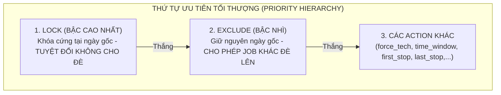
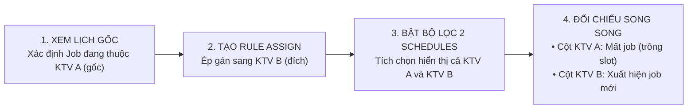

# CẨM NANG HƯỚNG DẪN TỰ TEST MANTIS CUSTOM RULES (CHUẨN HÓA KIẾN TRÚC)
## TÀI KHOẢN: `lamlam@gmail.com` (CHI NHÁNH: `GDONWL5A5MI6`)

---

## 1. NGUYÊN LÝ CỐT LÕI VỀ `EXCLUDE` & `LOCK` TRONG MANTIS

### So Sánh Bản Chất Kỹ Thuật:
| Tiêu chí | `exclude` | `lock` |
| :--- | :--- | :--- |
| **Vị trí ngày** | **Giữ nguyên job ở ngày gốc** | **Khóa cứng job ở ngày gốc** |
| **Cơ chế chiếm chỗ** | **Cho phép job khác đè lên** (Slot có thể được tái sử dụng / chèn vào) | **Tuyệt đối không cho đè** (Solver phải route xung quanh - Route Around) |
| **Thứ tự ưu tiên** | Thắng tất cả các action thường (`force_tech`, `first_stop`,...) | **Thắng tất cả, bao gồm cả `exclude`** |

---

## 2. QUY TRÌNH CHUẨN KIỂM TRA CÁC CASE ASSIGN / FORCE TECH (BẬT 2 SCHEDULES ĐỐI CHIẾU)

Khi kiểm tra một kịch bản **Điều Chuyển KTV (Assign / Force Tech)**, cách test chuẩn xác và trực quan nhất là:

### Các Bước Thao Tác Chi Tiết:
1. **Bước 1 - Xác định KTV gốc:** 
   - Mở Calendar hoặc Sandbox, xem khách hàng muốn test (ví dụ `Clark Kent`) ban đầu đang nằm ở cột KTV nào (ví dụ đang ở cột KTV `Lam`).
2. **Bước 2 - Tạo Rule Assign sang KTV mới:** 
   - Tạo rule ép sang KTV đích (ví dụ KTV `Minh`).
3. **Bước 3 - Mở bộ lọc Schedule và tích chọn đồng thời cả 2 KTV:**
   - Tại thanh công cụ bộ lọc phía trên (Schedules Filter): **Bật đồng thời cả KTV Lam và KTV Minh** (hoặc tích chọn cả 3 KTV: `Lam`, `custom`, `Minh`).
4. **Bước 4 - Quan sát chuyển dịch chéo (Cross-Schedule Delta):**
   - **Bên cột KTV `Lam` (gốc):** Ô công việc của khách hàng đó đã được rút đi (giải phóng slot thời gian).
   - **Bên cột KTV `Minh` (đích):** Ô công việc của khách hàng đó đã xuất hiện đúng vị trí theo yêu cầu.
   - $\rightarrow$ **Kết luận:** Chuyển giao thành công 100%, không bị sót hay nhân đôi job!

---

## 3. THÔNG TIN TRUY CẬP TRỰC TIẾP

| Hạng mục | Đường dẫn / Thông tin |
| :--- | :--- |
| **Trang đăng nhập** | [https://r2.gdesk.io/auth/login](https://r2.gdesk.io/auth/login) |
| **Email đăng nhập** | `lamlam@gmail.com` |
| **Mật khẩu** | `Ahihi123456@` |
| **Trang Custom Rules** | [https://r2.gdesk.io/GDONWL5A5MI6/mantis/settings/custom](https://r2.gdesk.io/GDONWL5A5MI6/mantis/settings/custom) |
| **Trang Mantis Sandbox** | [https://r2.gdesk.io/GDONWL5A5MI6/mantis/sandbox](https://r2.gdesk.io/GDONWL5A5MI6/mantis/sandbox) |
| **Trang Calendar đối chiếu** | [https://r2.gdesk.io/GDONWL5A5MI6/calendar?schedules=31,32,89](https://r2.gdesk.io/GDONWL5A5MI6/calendar?schedules=31,32,89) |

### Danh Sách 3 Schedules Của Tài Khoản:
- Schedule 1: **`Lam`** (ID: `31`)
- Schedule 2: **`custom`** (ID: `32`)
- Schedule 3: **`Minh`** (ID: `89`)

---

## 4. CÁC KỊCH BẢN TEST ASSIGN THỰC TẾ (BẬT 2 SCHEDULES)

---

### KỊCH BẢN ASSIGN 1: Điều Chuyển Clark Kent Từ KTV Lam Sang KTV Minh
* **Hiện trạng gốc:** Job của `Clark Kent` ban đầu đang nằm ở cột KTV `Lam`.
* **Prompt copy:**
  > `"Force technician Minh for customer Clark Kent."`
* **Cách thao tác kiểm chứng:**
  1. Vào Sandbox, mở bộ lọc Schedules $\rightarrow$ Tích chọn cả **Lam** và **Minh**.
  2. Đợi Solver tối ưu hóa 12-14 giây.
  3. **Kết quả đạt chuẩn:** 
     - Cột **Lam** không còn job của Clark Kent.
     - Cột **Minh** xuất hiện job của Clark Kent.

---

### KỊCH BẢN ASSIGN 2: Điều Chuyển FL Routing Test 03 Sang KTV Lam
* **Hiện trạng gốc:** Job của `FL Routing Test 03` ban đầu nằm rải rác ở `custom` hoặc `Minh`.
* **Prompt copy:**
  > `"For customer FL Routing Test 03, force technician Lam."`
* **Cách thao tác kiểm chứng:**
  1. Tích chọn cả 3 KTV: **Lam**, **custom**, **Minh**.
  2. Quan sát: Toàn bộ jobs của `FL Routing Test 03` được rút sạch khỏi các cột khác và gom toàn bộ về cột KTV **Lam**.

---

### KỊCH BẢN ASSIGN 3: Điều Chuyển Chéo 2 KTV (Vance sang Minh & NaplesAuto_5 sang custom)
* **Prompt copy:**
  > `"Force technician Minh for customer Vance and force technician custom for customer NaplesAuto_5 Test."`
* **Cách thao tác kiểm chứng:**
  1. Tích chọn hiển thị cả 3 KTV: **Lam**, **custom**, **Minh**.
  2. Cột **Minh** đón nhận job của `Vance`.
  3. Cột **custom** đón nhận job của `NaplesAuto_5 Test`.

---

## 5. TỔNG HỢP CÁC KỊCH BẢN KHÁC (EXCLUDE & LOCK)

* **Test `exclude` (Giữ ngày gốc & Cho phép đè):**
  > `"Exclude Call Back Service jobs from routing."`
* **Test `lock` (Khóa cứng ngày gốc & Cấm đè):**
  > `"Lock all jobs for customer Peter Parker on their scheduled day."`
* **Test Xung đột `lock` vs `exclude` (Lock thắng Exclude):**
  > `"Exclude jobs for customer FL Routing Test 01 from routing, but lock them on their scheduled day."`
* **Test Giữ ngày gốc (`keep_period: day`) + Đầu ngày (`first_stop`):**
  > `"Keep customer Peter Parker jobs scheduled on the same day and schedule as the first stop of the day."`

---

## 6. LƯU Ý KHI TEST
> [!IMPORTANT]
> Luôn nhớ bật bộ lọc **Schedules** hiển thị cả KTV gốc và KTV đích để nhìn thấy rõ ràng việc rút job từ KTV cũ và nạp job vào KTV mới. Sau khi test xong mỗi rule, hãy quay lại trang Settings gạt **Toggle về OFF** trước khi thử rule tiếp theo!
