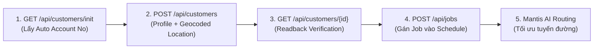

# KẾ HOẠCH KIỂM THỬ & TRIỂN KHAI TẠO KHÁCH HÀNG (MASTER PLAN: ADD CUSTOMER)

**Dự án:** GorillaDesk & Mantis AI Routing Autopilot  
**Môi trường:** Live UI (`r2.gdesk.io`) & Live API (`apiv2.gdesk.io`)  
**Tài khoản khảo sát:** `lam.pham@gmail.com` (Branch `GD1LK8RC5OH0`) & `lamlam@gmail.com` (Branch `GDONWL5A5MI6`)  
**Tài liệu tham chiếu:** `customer.har`, `listcustomer.har`, `florida_seed.py`, `add_us_customer_jobs_to_lam.py` (Codex_1 Archive)  
**Người lập plan:** Antigravity AI Agent & Pair Tester  

---

## I. MỤC TIÊU & TẦM QUAN TRỌNG CỦA VIỆC TẠO KHÁCH HÀNG (CUSTOMER)

Trong hệ thống GorillaDesk và thuật toán Mantis AI Routing:
1. **Khách hàng (Customer) là hạt nhân dữ liệu:** Mọi công việc (Job), lịch hẹn, doanh thu, và tuyến đường của kỹ thuật viên đều phải neo vào một `customer_id` và `location_id`.
2. **Quyết định tính chuẩn xác của Routing AI:**
   * **Tọa độ Geocoded (`lat`, `lng`) & ZIP Code:** Giúp thuật toán Mantis tính toán ma trận khoảng cách (`OSRM Distance Matrix`) và thời gian lái xe (`drive time`) thực tế giữa các điểm dừng.
   * **Thẻ Phân Loại (`customer_tags`):** Cung cấp dữ liệu để chạy các bộ lọc Custom Rules / Specific Rules (VD: `Customer Tag: VIP` $\rightarrow$ First Stop).
   * **Phân cụm địa lý (Regions/Clusters):** Tạo tập khách hàng theo cụm giúp kiểm thử các quy tắc vùng (`region_labels`, phân tuyến KTV theo khu vực).



---

## II. CHUẨN KỸ THUẬT BÓC TÁCH TỪ CODEBASE & CODEX_1

Dựa trên phân tích từ file `customer.har` thực tế và mã nguồn `florida_seed.py`:

### 1. Endpoint API Endpoints
| Thao Tác | Method | API Endpoint | Mục Đích & Lưu Ý Kỹ Thuật |
| :--- | :---: | :--- | :--- |
| **Khởi tạo form** | `GET` | `/api/customers/init` | Lấy số tài khoản tự sinh (`account_no`), cấu hình mặc định. |
| **Tạo mới khách hàng** | `POST` | `/api/customers` | Tạo Profile, Service Address, Geocoded lat/lng, Billing info. |
| **Xem chi tiết** | `GET` | `/api/customers/{id}` | Readback xác nhận thông tin sau khi tạo thành công. |
| **Lấy địa điểm rút gọn**| `GET` | `/api/customers/{id}/locations/simplify` | Lấy `location_id` chính xác để dùng cho API tạo Job. |
| **Tìm kiếm danh bạ** | `GET` | `/api/customers?keyword={name}` | Kiểm tra tính sẵn sàng hiển thị trên danh bạ và UI Search. |

### 2. Cấu Trúc Payload Chuẩn (`POST /api/customers`)
```json
{
  "profile": {
    "account_no": "CUST_AUTOTEST_01",
    "first_name": "Nguyen",
    "last_name": "Van A",
    "email": "customer.test@example.com",
    "phones": [
      { "type": "mobile", "number": "0901234567" }
    ],
    "source": "Web",
    "tags": ["VIP"],
    "status": "1"
  },
  "additional_contacts": [],
  "cards": [],
  "service_location": {
    "location_note": "Service gate at back",
    "billing_email": [],
    "mdu": {},
    "same_billing_location": true,
    "billing_address": {
      "bill_to": "Nguyen Van A",
      "street1": "123 Le Loi",
      "street2": "",
      "city": "Ho Chi Minh",
      "state": "SG",
      "zip": "70000",
      "country": "Vietnam",
      "county": "District 1",
      "formattedAddress": "123 Le Loi, District 1, Ho Chi Minh",
      "lng": 106.6983,
      "lat": 10.7769
    },
    "service_address": {
      "street1": "123 Le Loi",
      "street2": "",
      "city": "Ho Chi Minh",
      "state": "SG",
      "zip": "70000",
      "country": "Vietnam",
      "county": "District 1",
      "formattedAddress": "123 Le Loi, District 1, Ho Chi Minh",
      "lng": 106.6983,
      "lat": 10.7769
    },
    "location_name": "Headquarters",
    "address_to": "Nguyen Van A",
    "messaging_preferences": {},
    "wo_emails": []
  },
  "fast_form": true
}
```

> [!IMPORTANT]
> **Bài học xương máu từ Codex_1 (`florida_seed.py`):**
> API sẽ trả về lỗi **HTTP 422** nếu:
> 1. `Service Zip` hoặc `Billing Zip` bị để trống (`cannot be blank`).
> 2. `lat` và `lng` bị null (Mantis Routing sẽ không thể tính khoảng cách tuyến đường và đẩy job ra lỗi unassigned).

---

## III. MA TRẬN 10 TEST CASES CHI TIẾT CHO CHỨC NĂNG ADD CUSTOMER

Ma trận được thiết kế nhằm bao phủ cả kiểm thử chức năng giao diện, kiểm thử API, các thẻ phân loại phục vụ Mantis AI Routing và các trường hợp biên:

| STT | Mã Case | Tên Kịch Bản | Dữ Liệu Đầu Vào | Tiêu Chí PASS (Validation Criteria) |
| :---: | :---: | :--- | :--- | :--- |
| **1** | **TC-CUST-01** | **Tạo khách hàng chuẩn đầy đủ (Happy Path - Standard Customer)** | - Name: `Test Customer Standard`<br>- Phone, Email hợp lệ<br>- Địa chỉ đầy đủ ZIP & Lat/Lng<br>- Status: `1` (Active) | - API trả về `HTTP 200/201`, `success: true`.<br>- Trả về `customer_id` và `location.id`.<br>- Readback `GET /api/customers/{id}` khớp 100% dữ liệu. |
| **2** | **TC-CUST-02** | **Khách hàng gắn thẻ VIP Tag (Mantis AI Rule Target)** | - Name: `VIP Customer Alpha`<br>- Tag: `["VIP"]`<br>- Địa chỉ có Geocoding | - Customer được lưu kèm tag `VIP`.<br>- Khi truy vấn `GET /api/customers?tag=VIP`, xuất hiện trong kết quả.<br>- Sẵn sàng cho Custom Rule lọc `customer_tags: ["VIP"]`. |
| **3** | **TC-CUST-03** | **Khách hàng đa thẻ phân loại (Multi-Tags)** | - Name: `Commercial High Priority`<br>- Tags: `["VIP", "Commercial", "Priority"]` | - Cả 3 tags được lưu đầy đủ trong mảng `profile.tags`.<br>- Bộ lọc UI hiển thị đúng 3 badges thẻ màu. |
| **4** | **TC-CUST-04** | **Khách hàng Phân cụm Vùng 1 (Region 1 Cluster)** | - Cụm địa chỉ gần nhau (Ví dụ: 3 khách hàng cách nhau < 5km)<br>- Có tọa độ `lat`, `lng` chuẩn | - Ma trận khoảng cách giữa các khách < 15 phút lái xe.<br>- Phục vụ test gom cụm công việc của Mantis Solver. |
| **5** | **TC-CUST-05** | **Khách hàng Phân cụm Vùng 2 (Region 2 - Viễn thông/Ngoại thành)** | - Địa chỉ nằm cách xa Cụm 1 (> 40km)<br>- Có tọa độ `lat`, `lng` chuẩn | - Mantis AI phân biệt rõ 2 cụm địa lý độc lập để kiểm tra chia tuyến KTV theo vùng. |
| **6** | **TC-CUST-06** | **Billing Address khác Service Address** | - Service: Địa chỉ công trình thực tế<br>- Billing: Địa chỉ trụ sở thanh toán<br>- `same_billing_location`: `false` | - Hệ thống lưu tách biệt 2 địa chỉ.<br>- Tuyến đường Mantis chỉ sử dụng tọa độ của `service_address`. |
| **7** | **TC-CUST-07** | **Khách hàng Đa địa điểm (Multi-Locations)** | - 1 Khách hàng có 2 địa điểm phục vụ (Location A & Location B) | - `GET /customers/{id}/locations/simplify` trả về 2 locations.<br>- Có thể tạo 2 job riêng biệt trỏ về 2 `location_id` khác nhau. |
| **8** | **TC-CUST-08** | **Validation Lỗi: Thiếu trường bắt buộc (Missing ZIP / Address)** | - `zip`: `""` (Rỗng)<br>- `street1`: `""` | - API trả về lỗi **HTTP 422 Unprocessable Entity**.<br>- Thông báo lỗi rõ ràng: `"Service Zip cannot be blank."`. Hệ thống không crash. |
| **9** | **TC-CUST-09** | **Ký tự đặc biệt & Tiếng Việt có dấu** | - Name: `Công Ty TNHH Dịch Vụ Môi Trường & Pest Control 365 #01` | - Hệ thống lưu đúng chuẩn UTF-8, không bị lỗi font/lỗi encoding.<br>- Tìm kiếm trên danh bạ theo tên tiếng Việt ra đúng kết quả. |
| **10** | **TC-CUST-10** | **End-to-End: Tạo Customer $\rightarrow$ Tạo Job $\rightarrow$ Verify Mantis** | - Tạo Customer mới $\rightarrow$ Lấy `customer_id` + `location_id` $\rightarrow$ Gán 1 Job vào Calendar | - Job hiển thị trên Calendar đúng ngày.<br>- Mantis Sandbox nhận diện job của khách hàng mới và áp dụng tối ưu. |

---

## IV. QUY TRÌNH THỰC HIỆN KIỂM THỬ KHÉP KÍN (EXECUTION PROTOCOL)

1. **Bước 1 (Pre-check):**
   - Đăng nhập lấy Token và Branch ID (`GD1LK8RC5OH0` hoặc `GDONWL5A5MI6`).
   - Gọi `GET /api/customers/init` để lấy bộ đếm `account_no`.
2. **Bước 2 (Execute API / UI):**
   - Chạy script kiểm thử tạo khách hàng tương ứng theo từng case trong ma trận.
   - Chụp ảnh màn hình giao diện Customer Profile (`customer_profile.png`).
3. **Bước 3 (Readback & Verify):**
   - Đọc lại dữ liệu qua `GET /api/customers/{id}` và `GET /api/customers?keyword=...`.
   - Kiểm tra các trường: `id`, `first_name`, `tags`, `lat`, `lng`, `zip`.
4. **Bước 4 (Cleanup / Tagging):**
   - Đánh dấu tiền tố `[AUTO_TEST]` cho các khách hàng test để dễ dàng lọc và quản lý, tránh làm rác dữ liệu thực của tài khoản.
5. **Bước 5 (Đóng gói & Báo cáo):**
   - Xuất file kết quả `customer_test_results.json` và báo cáo markdown chi tiết.
   - Commit và push lên GitHub.
