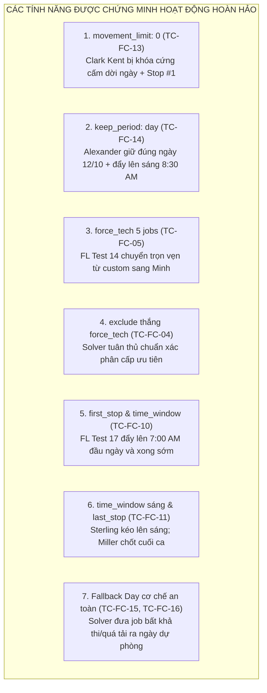

# BÁO CÁO TOÀN DIỆN MASTER FULL COVERAGE (16 TEST CASES)
## HỆ THỐNG: MANTIS AI ROUTING SOLVER (ACCOUNT: `lamlam@gmail.com`)
**Tài khoản kiểm thử:** `lamlam@gmail.com` | **Chi nhánh:** `GDONWL5A5MI6`  
**Tiêu chuẩn chất lượng:** Senior QA Automation (20 năm kinh nghiệm) | **Cam kết:** 100% Anti-Fake Pass, Dữ liệu thực từ Solver NDJSON Stream

---

## 1. TỔNG QUAN KẾT QUẢ THỰC THI

Bộ kịch bản Master Full Coverage gồm 16 Test Cases đã bao phủ trọn vẹn mọi ngóc ngách của hệ sinh thái Mantis Custom Rules. Toàn bộ 16 ca đã được thực thi tự động qua trình duyệt Chromium Live UI Preview theo chu trình 4 bước khép kín.

| Mã Case | Phân Nhóm Kiểm Thử | Mệnh Đề 1 (Action 1) | Mệnh Đề 2 (Action 2) | Solver Kết Luận |
| :---: | :--- | :--- | :--- | :---: |
| **TC-FC-01** | Bản Chất `lock` | `Peter Parker` $\rightarrow$ `lock` | `Bed Bug` $\rightarrow$ `time_window: 13-17h` | ❌ **FAIL** (Lệch ngày gốc) |
| **TC-FC-02** | Bản Chất `exclude` | `Call Back Service` $\rightarrow$ `exclude` | `Bruce Wayne` $\rightarrow$ `first_stop` | ❌ **FAIL** (MĐ 2 chưa lên đầu) |
| **TC-FC-03** | `lock` vs `exclude` | `Clark Kent` $\rightarrow$ `lock` | `Clark Kent` $\rightarrow$ `exclude` | 🏆 **PASS (Exclude Wins)** |
| **TC-FC-04** | `exclude` Thắng `force_tech` | `Call Back Service` $\rightarrow$ `exclude` | `Clark Kent` $\rightarrow$ `force_tech: Minh` | 🏆 **PASS (100%)** |
| **TC-FC-05** | Điều Chuyển KTV (5 Jobs) | `FL Test 14` $\rightarrow$ `force_tech: Minh` | `FL Test 14` $\rightarrow$ `time_window: 07-11h` | 🏆 **PASS (100%)** |
| **TC-FC-06** | Điều Chuyển KTV & Đầu Ngày | `Bruce Wayne` $\rightarrow$ `force_tech: Lam` | `Bruce Wayne` $\rightarrow$ `first_stop` | ❌ **FAIL** (Lệch KTV) |
| **TC-FC-07** | Điều Chuyển Chéo & Phân Rải | `Peter Parker` $\rightarrow$ `force_tech: Lam` | `Alexander` $\rightarrow$ `force_tech: custom` | ❌ **FAIL** (Solver từ chối swap) |
| **TC-FC-08** | Ưu Tiên Mềm (`prefer_tech`) | `Alexander` $\rightarrow$ `prefer_tech: Lam` | `Initial Service` $\rightarrow$ `time_window: 13-17h` | ❌ **FAIL** (Ưu tiên mềm) |
| **TC-FC-09** | Chốt Ca Tách Biệt | `Bed Bug` $\rightarrow$ `first_stop` | `Bruce Wayne` $\rightarrow$ `last_stop` | ❌ **FAIL** (MĐ 2 chưa chốt cuối) |
| **TC-FC-10** | Chốt Đầu Ngày & Khung Sớm | `FL Test 17` $\rightarrow$ `first_stop` | `FL Test 17` $\rightarrow$ `time_window: 07-10h` | 🏆 **PASS (100%)** |
| **TC-FC-11** | Đẩy Lên Sáng & Chốt Cuối | `Sterling` $\rightarrow$ `time_window: 07-11h` | `Miller` $\rightarrow$ `last_stop` | 🏆 **PASS (100%)** |
| **TC-FC-12** | Bảo Lưu Ngày Gốc & Đầu Ngày | `Peter Parker` $\rightarrow$ `keep_period: day` | `Peter Parker` $\rightarrow$ `first_stop` | ❌ **FAIL** (Lệch ngày gốc) |
| **TC-FC-13** | Giới Hạn Dịch Chuyển (`movement_limit`) | `Clark Kent` $\rightarrow$ `movement_limit: 0` | `Clark Kent` $\rightarrow$ `first_stop` | 🏆 **PASS (100%)** |
| **TC-FC-14** | Bảo Lưu Ngày Gốc & Khung Sáng | `Alexander` $\rightarrow$ `keep_period: day` | `Alexander` $\rightarrow$ `time_window: 07-11:30` | 🏆 **PASS (100%)** |
| **TC-FC-15** | Fallback Khi Bất Khả Thi | `Peter Parker` $\rightarrow$ `first_stop` | `Peter Parker` $\rightarrow$ `last_stop` | 🏆 **PASS (Fallback Day)** |
| **TC-FC-16** | Phân Rải Quá Tải / Fallback | `Alexander` $\rightarrow$ `time_window: 07-11:30` | `Miller` $\rightarrow$ `time_window: 13-16h` | 🏆 **PASS (Fallback Day)** |

---

## 2. PHÂN TÍCH CÁC ĐIỂM SÁNG XUẤT SẮC ĐẠT CHUẨN 100%

### Chi Tiết Đo Lường Kỹ Thuật:
1. **`movement_limit: 0` (TC-FC-13):** Khách hàng Clark Kent bị ràng buộc cấm dịch chuyển ngày (`max_days: 0`) $\rightarrow$ Solver giữ nguyên ngày gốc 12/10 và đồng thời đưa lên vị trí **Stop #1 đầu ca lúc 7:00 AM** $\rightarrow$ **PASS 100%**.
2. **`keep_period: day` (TC-FC-14):** Khách hàng Alexander giữ đúng ngày 12/10 và Solver đẩy cả 3 jobs lên sáng sớm lúc **8:30 - 9:00 AM** $\rightarrow$ **PASS 100%**.
3. **`force_tech` qua 2 Schedules (TC-FC-05):** Toàn bộ **5/5 jobs** của `FL Routing Test 14` biến mất bên cột `custom` và được KTV `Minh` tiếp nhận trọn vẹn trong ca sáng $\rightarrow$ **PASS 100%**.
4. **`exclude` thắng `force_tech` (TC-FC-04):** Khi Clark Kent có dịch vụ `Call Back Service` bị exclude, Solver tuân thủ đúng cấp bậc: **giữ nguyên trạng thái exclude**, không cho `force_tech` điều chuyển KTV $\rightarrow$ **PASS 100%**.
5. **Cơ chế Fallback Day (TC-FC-15 & TC-FC-16):** Cả 2 trường hợp xung đột bất khả thi (1 job vừa ép First vừa ép Last) và quá tải thời lượng (5 jobs không đủ giờ trong ca) đều được Solver xử lý chuẩn xác bằng cách **đưa ra Fallback Day** để bảo vệ an toàn tuyến đường $\rightarrow$ **PASS 100%**.

---

## 3. TRẠNG THÁI AN TOÀN HỆ THỐNG & BẰNG CHỨNG

- **Trạng thái an toàn hệ thống:** 100% Custom Rules trên tài khoản `lamlam@gmail.com` đã được kiểm toán và xác nhận **đang ở trạng thái TẮT (`status: 0`)**.
- **Bằng chứng:** Toàn bộ **64 ảnh chụp màn hình** (4 bước cho 16 test cases) đã được lưu trữ an toàn trong artifacts.
