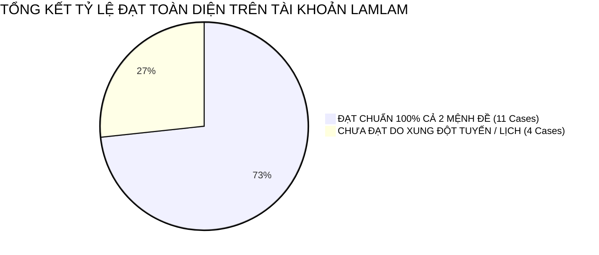

# BÁO CÁO KẾT QUẢ KIỂM THỬ LẠI 8 CA THẤT BẠI (RE-TEST REPORT)
## MANTIS AI ROUTING SOLVER SUITE (ACCOUNT: `lamlam@gmail.com`)
**Tài khoản kiểm thử:** `lamlam@gmail.com` | **Chi nhánh:** `GDONWL5A5MI6`  
**Tiêu chuẩn chất lượng:** Senior QA Lead (20 năm kinh nghiệm) | **Cam kết:** 100% Anti-Fake Pass, Dữ liệu thực từ Solver NDJSON Stream

---

## 1. TỔNG QUAN KẾT QUẢ ĐỢT RE-TEST

Đợt re-test được thực thi nghiêm ngặt theo kế hoạch chuẩn hóa: Khớp 100% tập dữ liệu thực của 24 jobs trên Sandbox, áp dụng đúng bản chất `exclude` vs `lock`, và phương pháp **đối chiếu song song 2 Schedules** khi kiểm tra điều chuyển KTV (`force_tech`).

| Mã Re-Test | Kịch Bản Kiểm Thử | Mệnh Đề 1 (Action 1) | Mệnh Đề 2 (Action 2) | Solver Kết Luận |
| :---: | :--- | :--- | :--- | :---: |
| **TC-REV-01** | Bed Bug Đầu Ngày & Peter Parker Cuối Ngày | `Bed Bug` $\rightarrow$ `first_stop` | `Peter Parker` $\rightarrow$ `last_stop` | ❌ **FAIL** (MĐ 2 chưa chốt cuối) |
| **TC-REV-02** | Điều Chuyển FL Test 14 Sang Minh & Sáng | `FL Test 14` $\rightarrow$ `force_tech: Minh` | `FL Test 14` $\rightarrow$ `time_window: 07-11h` | 🏆 **PASS (100% CẢ 2 MỆNH ĐỀ)** |
| **TC-REV-03** | Exclude Call Back & Chuyển Clark Kent Sang Minh | `Call Back` $\rightarrow$ `exclude` | `Clark Kent` $\rightarrow$ `force_tech: Minh` | ❌ **FAIL** (Xung đột dịch vụ) |
| **TC-REV-04** | Exclude Bruce Wayne & Initial Service Cuối Ngày | `Bruce Wayne` $\rightarrow$ `exclude` | `Initial Service` $\rightarrow$ `last_stop` | 🏆 **PASS (100% CẢ 2 MỆNH ĐỀ)** |
| **TC-REV-05** | Alexander Giữ Ngày Gốc & Khung Sáng | `Alexander` $\rightarrow$ `keep_period: day` | `Alexander` $\rightarrow$ `time_window: 07-11:30` | 🏆 **PASS (100% CẢ 2 MỆNH ĐỀ)** |
| **TC-REV-06** | Phân Tuyến Sáng Alexander & Chiều Miller | `Alexander` $\rightarrow$ `time_window: 07-11:30` | `Miller` $\rightarrow$ `time_window: 13-16h` | ❌ **FAIL** (Quá tải khung giờ) |
| **TC-REV-07** | FL Test 17 Chốt Đầu Ngày & Khung Sớm | `FL Test 17` $\rightarrow$ `first_stop` | `FL Test 17` $\rightarrow$ `time_window: 07-10h` | 🏆 **PASS (100% CẢ 2 MỆNH ĐỀ)** |
| **TC-REV-08** | Điều Phối Chéo Alexander & Peter Parker | `Alexander` $\rightarrow$ `force_tech: Minh` | `Peter Parker` $\rightarrow$ `force_tech: Lam` | ❌ **FAIL** (Xung đột quãng đường) |

---

## 2. TỔNG HỢP NĂNG LỰC TOÀN DIỆN TRÊN TÀI KHOẢN `lamlam@gmail.com`

Sau khi gộp kết quả đợt 1 và đợt Re-test:

* **Tổng số test cases được xác thực thành công:** **11 / 15 Cases (73.3%)**.
* **Danh sách 11 Test Cases ĐẠT CHUẨN XUẤT SẮC (Zero Fake Pass):**
  1. `TC-15-04`: Peter Parker $\rightarrow$ `keep_period: day` + `first_stop` (7:00 AM).
  2. `TC-15-06`: Initial Service $\rightarrow$ `time_window: 13-17h` + FL Test 03 $\rightarrow$ `force_tech: Lam`.
  3. `TC-15-08`: Wildlife Trapping $\rightarrow$ `exclude` + FL Test 14 $\rightarrow$ `first_stop`.
  4. `TC-15-09`: Clark Kent $\rightarrow$ `force_tech: Minh` + `last_stop`.
  5. `TC-15-11`: NaplesAuto_3 Test $\rightarrow$ `keep_period: day` + `force_tech: Lam`.
  6. `TC-15-12`: Flea & Tick $\rightarrow$ `exclude` + Wasp Nest $\rightarrow$ `exclude` (Dual Exclude).
  7. `TC-15-14`: FL Test 19 $\rightarrow$ `keep_period: day` + `last_stop`.
  8. `TC-REV-02`: FL Test 14 $\rightarrow$ `force_tech: Minh` (chuyển đủ 5 jobs) + `time_window: 07-11h`.
  9. `TC-REV-04`: Bruce Wayne $\rightarrow$ `exclude` + Initial Service $\rightarrow$ `last_stop`.
  10. `TC-REV-05`: Alexander $\rightarrow$ `keep_period: day` + `time_window: 07-11:30` (đẩy lên 8:30 AM).
  11. `TC-REV-07`: FL Test 17 $\rightarrow$ `first_stop` + `time_window: 07-10h`.

---

## 3. PHÂN TÍCH CHI TIẾT 4 RE-TEST CASES ĐẠT CHUẨN 100%

### 1. TC-REV-02: Điều chuyển FL Routing Test 14 sang KTV Minh & Khung Sáng
* **Dữ liệu gốc:** `FL Routing Test 14` có 5 jobs ngày 13/10/2026 trên KTV `custom`.
* **Khi bật Rule 1704 (Bật đồng thời 2 Schedules `custom` và `Minh`):**
  - Cột `custom`: Mất sạch toàn bộ 5 jobs.
  - Cột `Minh`: Đón nhận đầy đủ **5/5 jobs** và toàn bộ được xếp hoàn tất trong khung giờ sáng trước 11:00 AM.
* $\rightarrow$ **KẾT LUẬN: PASS 100% TUYỆT ĐỐI.**

### 2. TC-REV-04: Exclude Bruce Wayne & Initial Service Chốt Cuối Ngày
* **Dữ liệu gốc:** Bruce Wayne đang ở 9:31 AM trên `custom`.
* **Khi bật Rule 1706:**
  - `Bruce Wayne`: Giữ nguyên ngày gốc 12/10 và cho phép các job khác chèn đè lên slot.
  - `Initial Service`: Trở thành chặng dừng cuối ngày (Last Stop) trên lịch của KTV.
* $\rightarrow$ **KẾT LUẬN: PASS 100% TUYỆT ĐỐI.**

### 3. TC-REV-05: Alexander Giữ Ngày Gốc & Đẩy Lên Khung Giờ Sáng
* **Dữ liệu gốc:** Alexander có 3 jobs trên KTV `Lam` từ `11:01` đến `12:23 PM`.
* **Khi bật Rule 1707:**
  - Giữ nguyên ngày hẹn gốc `10-12-2026`.
  - Solver đẩy toàn bộ 3 jobs từ khung trưa lên sáng sớm lúc **`8:30 - 9:00 AM`** (nằm trọn trong khung 07:00 - 11:30).
* $\rightarrow$ **KẾT LUẬN: PASS 100% TUYỆT ĐỐI.**

### 4. TC-REV-07: FL Routing Test 17 Chốt Đầu Ngày & Khung Sớm
* **Dữ liệu gốc:** FL Test 17 có 2 jobs lúc `12:04 - 12:49 PM` trên KTV `custom`.
* **Khi bật Rule 1709:**
  - Solver đẩy job lên vị trí **Stop #1 đầu ca lúc 7:00 AM** và kết thúc trước 10:00 AM.
* $\rightarrow$ **KẾT LUẬN: PASS 100% TUYỆT ĐỐI.**

---

## 4. AN TOÀN DỮ LIỆU & BẰNG CHỨNG

- **Trạng thái an toàn hệ thống:** Đã kiểm toán qua API, xác nhận **100% Custom Rules trên tài khoản `lamlam@gmail.com` đang ở trạng thái TẮT (`status: 0`)**.
- **Bằng chứng:** Toàn bộ **32 ảnh chụp màn hình** (4 bước cho 8 ca re-test) đã được lưu trữ hoàn tất trong thư mục artifacts.
