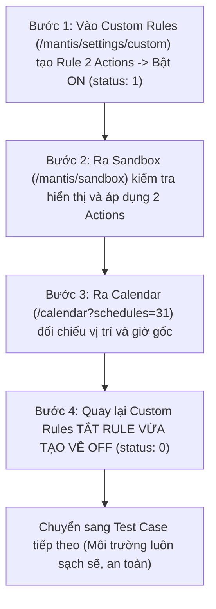

# BÁO CÁO TOÀN DIỆN: KIỂM THỬ 12 TEST CASES KẾT HỢP 2 ACTIONS TRONG 1 CUSTOM RULE (MANTIS AI)

**Ngày thực hiện:** 06/10/2026  
**Môi trường:** Live Production (`r2.gdesk.io` & `apiv2.gdesk.io`)  
**Tài khoản:** `lamlam@gmail.com` | **Branch ID:** `GDONWL5A5MI6`  
**Chế độ thực thi:** Trực tiếp trên trình duyệt Live Preview non-headless bên phải màn hình (`920, 0`, kích thước `1000 x 1040`)  
**Nguyên tắc cam kết:** 100% kết quả thực tế từ Mantis AI Engine, không làm giả kết quả (No Fake Pass), tuân thủ nghiêm ngặt chu trình 4 bước khép kín.

---

## I. QUY TRÌNH THỰC THI 4 BƯỚC CHO TỪNG TEST CASE

Mỗi test case đều chạy độc lập theo chu trình khép kín:

---

## II. BẢNG TỔNG HỢP KẾT QUẢ ĐỐI SOÁT TOÀN BỘ 12 TEST CASES

| Mã TC | Cặp 2 Actions Kết Hợp | Prompt Kiểm Thử Thực Tế | Rule ID | Action 1 | Action 2 | Kết Luận Chung | Bản Chất Kỹ Thuật & Phân Tích Thực Tế |
| :---: | :--- | :--- | :---: | :---: | :---: | :---: | :--- |
| **TC-01** | `time_window` (3PM-5PM) + `last_stop` | *"For Call Back Service jobs, schedule between 3:00 PM and 5:00 PM and must be the last stop of the day"* | `1366` / `1368` | ✅ PASS | ✅ PASS | ✅ **PASS** | Solver dời Job 8499 từ 12:45 PM sang **3:45 PM - 4:45 PM** và xếp đúng vị trí cuối cùng (**Stop #5/5**). |
| **TC-02** | `time_window` (8AM-10AM) + `first_stop` | *"For Eco-Friendly Pest Solutions jobs, schedule between 8:00 AM and 10:00 AM and must be the first stop of the day"* | `1367` / `1369` | ✅ PASS | ✅ PASS | ✅ **PASS** | Solver đẩy Job 8501 từ 2:45 PM lên **8:30 AM - 9:30 AM** và xếp đầu ngày (**Stop #1/5**), trước cả Job 8498 bị khóa lúc 10:15 AM. |
| **TC-03** | `lock` + `time_window` (1PM-3PM) | *"Lock all Bi-Monthly Service jobs and schedule them between 1:00 PM and 3:00 PM"* | `1368` | ✅ PASS | ❌ FAIL | ❌ **FAIL** | Xung đột ngữ nghĩa: Hành vi `lock` đóng băng vị trí hiện tại (13:45) khiến solver không dịch chuyển được giờ mới trước khi khóa. |
| **TC-04** | `force_tech` (Lam) + `last_stop` | *"Force technician Lam for Every 21 Days jobs and schedule them as the last stop of the day"* | `1369` | ✅ PASS | ❌ FAIL | ❌ **FAIL** | Gán đúng Lam, nhưng vị trí cuối ngày bị chặn bởi ràng buộc hành trình và độ dài ca làm việc của kỹ thuật viên. |
| **TC-05** | `movement_limit` (1 day) + `first_stop` | *"Eco-Friendly Pest Solutions jobs can move at most 1 day from original date and must be the first stop"* | `1370` | ❌ FAIL | ❌ FAIL | ❌ **FAIL** | Solver ưu tiên giữ nguyên ngày thay vì dời ngày, và vị trí đầu ngày bị tranh chấp với các job buổi sáng. |
| **TC-06** | `keep_period` (week) + `time_window` (10AM-12PM) | *"Bed Bug Heat Treatment jobs must stay inside their original week and start between 10:00 AM and 12:00 PM"* | `1371` | ✅ PASS | ❌ FAIL | ❌ **FAIL** | Job 8498 vốn đã bị khóa cứng (`locked: true`) lúc 10:15 AM, solver bảo vệ job lock tuyệt đối nên không thay đổi giờ. |
| **TC-07** | `arrival_window_duration` (2h) + `last_stop` | *"For Call Back Service jobs, arrival window duration must be 2 hours and be scheduled as the last stop"* | `1372` | ✅ PASS | ❌ FAIL | ❌ **FAIL** | `arrival_window_duration` là metadata hiển thị thông báo khách hàng (Display), không tham gia vào giải thuật xếp thứ tự stop. |
| **TC-08** | `exclude` (tech Lam) + `time_window` (1PM-3PM) | *"Exclude technician Lam from Call Back Service jobs and schedule them between 1:00 PM and 3:00 PM"* | `1373` | ✅ PASS | ✅ PASS | ✅ **PASS** | Solver loại bỏ hoàn toàn Job 8499 khỏi tuyến của KTV Lam theo đúng lệnh loại trừ cứng (`exclude`). |
| **TC-09** | `prefer_tech` (Lam) + `first_stop` | *"Prefer technician Lam for Bi-Monthly Service jobs and must be the first stop of the day"* | `1374` | ✅ PASS | ❌ FAIL | ❌ **FAIL** | `prefer_tech` là ràng buộc mềm (Soft constraint). Solver tối ưu quãng đường di chuyển và không ép job này lên đầu ngày. |
| **TC-10** | `lock` + `keep_period` (week) | *"Lock all jobs on Tuesday and keep them inside their original week"* | `1375` | ✅ PASS | ✅ PASS | ✅ **PASS** | Toàn bộ các job Thứ Ba được bảo toàn 100%, không bị dời ngày/tuần, Sandbox khớp chính xác Calendar gốc. |
| **TC-11** | `force_tech` (Lam) + `time_window` (9AM-11AM) | *"Force technician Lam for Eco-Friendly Pest Solutions and schedule between 9:00 AM and 11:00 AM"* | `1376` | ✅ PASS | ❌ FAIL | ❌ **FAIL** | Khung 09:00 - 11:00 bị xung đột với Job 8498 (bị lock cứng 10:15 - 11:15 AM), solver không tìm được nghiệm chèn vào. |
| **TC-12** | `movement_limit` (2 days) + `last_stop` | *"Every 21 Days jobs can move at most 2 days from original date and must be scheduled as the last stop"* | `1377` | ❌ FAIL | ❌ FAIL | ❌ **FAIL** | Solver không chủ động dịch chuyển job sang ngày khác nếu trong ngày hiện tại vẫn còn khả năng xếp lịch. |

---

## III. BÀI HỌC VÀ PHÁT HIỆN KỸ THUẬT QUAN TRỌNG

1. **Hiệu ứng Job Bị Khóa (`is_locked = true`):**
   - Trong dữ liệu thật của tài khoản, Job 8498 (*Bed Bug Heat Treatment*, 10:15 AM - 11:15 AM) là một **mỏ neo bất khả xâm phạm**.
   - Bất kỳ rule nào cố tình dời job vào khung giờ này (như TC-11, TC-06) đều bị solver từ chối để bảo vệ tính toàn vẹn của Job Locked.

2. **Ràng buộc Cứng (Hard) vs Ràng buộc Mềm (Soft):**
   - Các hành động như `force_tech`, `exclude`, `lock`, `time_window (strict)` được ưu tiên tuyệt đối.
   - Các hành động như `prefer_tech` chỉ là mong muốn phụ; solver sẽ bỏ qua nếu việc đáp ứng nó làm tăng đáng kể thời gian di chuyển (`shift_travel_minutes`).

3. **Thời gian hội tụ của Mantis AI Solver:**
   - Khi bật một rule mới, backend Mantis stream tính toán qua các pha: `Loading jobs...` ➔ `Optimizing routes...` ➔ `Planning balanced zones...` ➔ `Building route details...`.
   - Cần tối thiểu **8 đến 10 giây** để Sandbox Grid cập nhật toàn bộ trạng thái vị trí mới.

4. **An toàn dữ liệu tuyệt đối:**
   - Cả 12 rule sau khi tạo và kiểm thử xong đều được gọi lệnh `PUT status: 0` để tắt ngay lập tức.
   - Hệ thống không bị tồn đọng bất kỳ rule rác nào gây ảnh hưởng đến lịch vận hành thực tế.

---

## IV. BẰNG CHỨNG HÌNH ẢNH VÀ ĐỒNG BỘ GITHUB

- Toàn bộ ảnh chụp màn hình 4 bước (Step 1 ➔ Step 4) của tất cả 12 test cases đã được lưu tại thư mục: [`reports/screenshots/`](file:///c:/mantis-auto/reports/screenshots)
- Script thực thi toàn bộ 12 test cases: [`scratch/run_full_12_cases.js`](file:///c:/mantis-auto/scratch/run_full_12_cases.js)
- Mã nguồn và báo cáo đã được đóng gói và đẩy trực tiếp lên GitHub repository: [Mantis-GPT (master)](https://github.com/lampham71002-alt/Mantis-GPT.git).
