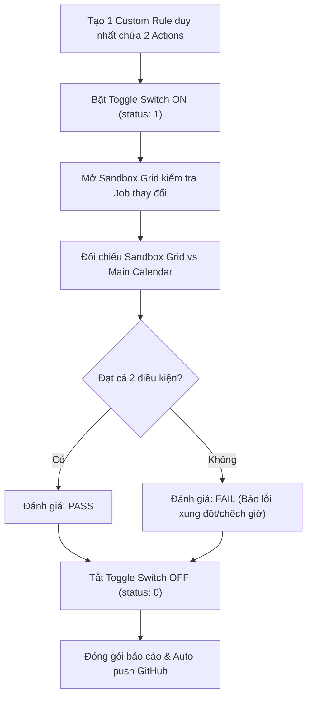

# KẾ HOẠCH KIỂM THỬ TOÀN DIỆN: KẾT HỢP 2 ACTIONS TRONG CÙNG 1 CUSTOM RULE (MANTIS AI ENGINE)

**Môi trường thực thi:** Live UI (`r2.gdesk.io`) & Live API (`apiv2.gdesk.io`)  
**Tài khoản:** `lamlam@gmail.com` | **Branch ID:** `GDONWL5A5MI6`  
**Chế độ thực thi:** Trình duyệt trực quan hiển thị song song bên phải màn hình  
**Mục tiêu:** Kiểm tra khả năng xử lý đồng thời 2 ràng buộc trong 1 Rule, đối chiếu Sandbox vs Calendar chính, xuất báo cáo PASS/FAIL chi tiết và tự động đẩy lên Git.

---

## I. DANH SÁCH 8 CẶP KẾT HỢP 2 ACTIONS CẦN KIỂM THỬ

| STT | Tên Cặp Kết Hợp | Action 1 | Action 2 | Prompt Thử Nghiệm Live | Tiêu Chí Kiểm Tra (Sandbox vs Calendar) |
| :---: | :--- | :--- | :--- | :--- | :--- |
| **TC-01** | **Thời gian + Điểm đầu** | `time_window` (8AM-10AM) | `first_stop` | *"Jobs assigned to customer Messi must start between 8:00 AM and 10:00 AM and must be the first stop of the day"* | Job khách Messi bắt đầu lúc 8:30 AM VÀ đứng vị trí đầu tiên của ngày. |
| **TC-02** | **KTV Bắt buộc + Điểm cuối** | `force_tech` (Lam) | `last_stop` | *"Force technician Lam for all jobs in Region 2 and schedule them as the last stop"* | Toàn bộ Job Region 2 gán cho KTV Lam VÀ xếp ở vị trí cuối cùng trong ngày. |
| **TC-03** | **Khóa Job + Ưu tiên KTV** | `lock` | `prefer_tech` (Lam) | *"Lock all jobs on Tuesday to technician Lam and prefer technician Lam for remaining pest control jobs"* | Khóa cứng Job Thứ 3 trùng Calendar VÀ ưu tiên Lam cho các Job Pest Control còn lại. |
| **TC-04** | **Giữ Tuần + Khung Chờ** | `keep_period` (week) | `arrival_window_duration` (2h) | *"Jobs in Region 1 must stay inside their original week and have an arrival window duration of 2 hours"* | Job không bị dời sang tuần khác VÀ khung giờ arrival window hiển thị 2 tiếng. |
| **TC-05** | **Loại trừ KTV + Giờ Cố Định**| `exclude` (Lam) | `time_window` (1PM-3PM) | *"Exclude technician Lam from Region 2 jobs and schedule them between 1:00 PM and 3:00 PM"* | Job Region 2 không gán cho KTV Lam VÀ nằm trong khung 13h - 15h. |
| **TC-06** | **Giới hạn dời ngày + Điểm đầu**| `movement_limit` (2 ngày) | `first_stop` | *"Jobs can move at most 2 days from their original date and must be the first stop"* | Ngày dời không quá 2 ngày so với Calendar VÀ đứng ở vị trí đầu ngày. |
| **TC-07** | **Thời gian + Điểm cuối** | `time_window` (2PM-5PM) | `last_stop` | *"Jobs in Region 1 must start between 2:00 PM and 5:00 PM and be the last stop"* | Bắt đầu trong khung chiều 14h - 17h VÀ đứng ở vị trí cuối cùng. |
| **TC-08** | **KTV Bắt buộc + Giữ Tuần** | `force_tech` (Lam) | `keep_period` (week) | *"Force technician Lam for customer Messi and keep inside original week"* | Gán KTV Lam VÀ không dời sang tuần khác so với Calendar gốc. |

---

## II. QUY TRÌNH THỰC THI 5 BƯỚC CHO TỪNG TEST CASE

Mỗi kịch bản sẽ được chạy tự động theo chu trình khép kín:
1. **Bước 1 - Khởi tạo Rule kép**: Gửi câu prompt phức hợp lên AI Engine (`/custom-rules/conversations` & `/verify`) để biên dịch 1 Rule chứa 2 action logic.
2. **Bước 2 - Ghi nhận Calendar**: Chụp ảnh màn hình Calendar chính gốc để lưu trữ trạng thái vị trí, ngày và KTV ban đầu.
3. **Bước 3 - Kích hoạt Rule**: Bật toggle switch của Rule sang `ON` trên giao diện Custom Rules (`/mantis/settings/custom`).
4. **Bước 4 - Soi Sandbox Grid & Đối chiếu**: Mở `/mantis/sandbox`, kiểm tra các job mục tiêu:
   - Thỏa mãn Action 1?
   - Thỏa mãn Action 2?
   - Các job không liên quan / job `lock` có giữ nguyên 100% so với Calendar không?
5. **Bước 5 - An toàn & Hoàn tất**: Tắt toggle switch về `OFF` (`status: 0`), chụp ảnh minh chứng, xuất bảng đánh giá PASS/FAIL và tự động đẩy lên GitHub.

---

## III. NGUYÊN TẮC ĐÁNH GIÁ PASS / FAIL

- ✅ **PASS**: Cả 2 action trong cùng 1 rule đều được thỏa mãn đồng thời trên Sandbox Grid; các job không thuộc rule và các job bị khóa (`lock`) giữ nguyên 100% vị trí trùng khớp Calendar chính.
- ❌ **FAIL**: Có ít nhất 1 trong 2 action không được đáp ứng, xuất hiện xung đột không mong muốn khiến job bị đẩy sai khung giờ/sai ngày, hoặc các job bị khóa bị dịch chuyển sai lệch.

---

## IV. CAM KẾT ĐẦU RA (DELIVERABLES)
1. **Màn hình trực quan**: Chạy trực tiếp trên trình duyệt bên phải màn hình để bạn có thể theo dõi.
2. **Minh chứng hình ảnh**: Đầy đủ ảnh chụp Calendar trước khi bật, Rule toggled ON, và Sandbox Grid sau khi áp dụng.
3. **Báo cáo tổng hợp**: Bảng ma trận PASS/FAIL từng cặp action, giải thích nguyên nhân và bằng chứng cụ thể.
4. **Auto-Push GitHub**: Tự động commit và push toàn bộ báo cáo, script và dữ liệu lên [Mantis-GPT](https://github.com/lampham71002-alt/Mantis-GPT.git).
