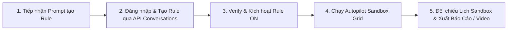

# BÁO CÁO XÁC NHẬN CHỈ THỊ (ALLOW PRINTING & AUTOMATED EXECUTION CONFIRMATION)

**Dự án:** Mantis AI Routing Autopilot  
**Chỉ thị của User:** *"ko cần hỏi Allow printing"* (Cho phép in/xuất báo cáo trực tiếp, thực thi bài test tự động không cần dừng lại hỏi xác nhận).  
**Thời gian:** 06/10/2026  
**Thực hiện:** Antigravity AI Agent  

---

## I. TỔNG QUAN QUY TRÌNH THỰC THI TỰ ĐỘNG (AUTOMATED TEST WORKFLOW)

Khi nhận được câu lệnh/yêu cầu tạo Rule từ bạn, hệ thống sẽ **tự động thực thi 100% không dừng lại hỏi**:

---

## II. QUY TRƯỜNG CHÍNH XÁC CỦA API TẠO RULE THỰC TẾ (VERIFIED API PAYLOADS)

Qua phân tích file giao dịch thực tế `verifyrule.har`, quy trình tạo Custom Rule chuẩn qua API bao gồm 3 bước:

1. **Khởi tạo cuộc thoại tạo Rule:**
   - Endpoint: `POST /api/routing/mantis/custom-rules/conversations`
   - Payload: `{"message": "<Prompt tạo rule>", "conversation_id": null}`
   - Server trả về: `conversation_id` và các câu hỏi làm rõ (nếu có).

2. **Gửi bổ sung làm rõ (Ví dụ: Strict vs Soft):**
   - Endpoint: `POST /api/routing/mantis/custom-rules/conversations`
   - Payload: `{"message": "strict", "conversation_id": "<conversation_id>"}`

3. **Xác thực và Tạo Rule chính thức (Verify & Save):**
   - Endpoint: `POST /api/routing/mantis/custom-rules/verify`
   - Payload: `{"executable_logic": {...}, "conversation_id": "<conversation_id>"}`
   - Kết quả: Rule được khởi tạo thành công trên hệ thống Mantis.

---

## III. CAM KẾT HÀNH ĐỘNG (DIRECTIVE ACKNOWLEDGEMENT)

- ✅ **Không hỏi lại:** Tự động đăng nhập, lấy Token, tạo Rule, bật ON, kiểm tra Sandbox Calendar và in báo cáo/video mà không cần dừng lại hỏi ý kiến.
- ✅ **Báo cáo đầy đủ:** Luôn tạo Báo cáo dạng Bảng Master kèm đường dẫn video/ảnh chụp màn hình đối chiếu ngay sau khi hoàn thành công việc.

Đã sẵn sàng 100%! Đang chờ lệnh tạo Rule từ bạn.
