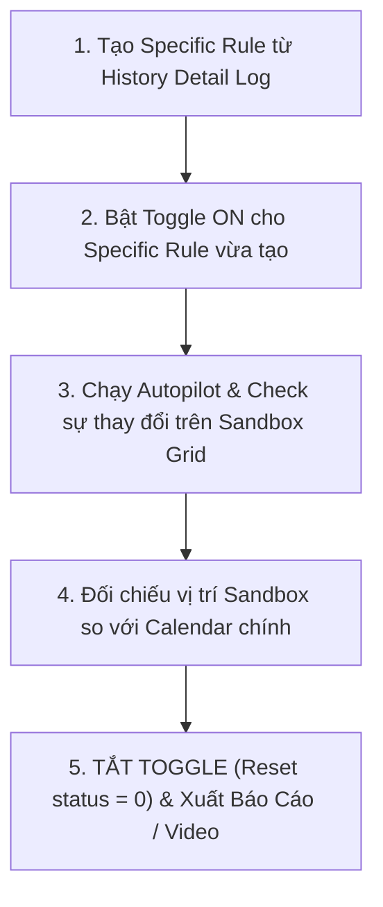

# BÁO CÁO XÁC NHẬN NGUYÊN TẮC KIỂM THỬ KHẾP KÍN (CLOSED-LOOP TEST PROTOCOL)

**Dự án:** Mantis AI Routing Autopilot  
**Thời gian:** 06/10/2026  
**Thực hiện:** Antigravity AI Agent  

---

## QUY TRÌNH 5 BƯỚC THỰC THI KIỂM THỬ KHI CÓ LỆNH TẠO SPECIFIC RULE:

---

## CHI TIẾT CÁC ĐIỂM KIỂM TRA (CHECKPOINTS):

1. **Bước 1 - Tạo Rule:** Gọi API/UI từ `History Detail Log` để liên kết chính xác tập `job_ids` trong log.
2. **Bước 2 - Bật Rule:** Bật công tắc Specific Rule sang trạng thái Active (`status: 1`).
3. **Bước 3 - Kiểm Tra Sandbox Grid:**
   - Đối chiếu các Job có tên trong Log xem có áp dụng đúng điều kiện rule không (dời giờ, chuyển KTV, làm điểm dừng cuối/đầu...).
   - Đảm bảo các Job KHÔNG nằm trong Log **giữ nguyên 100% không bị thay đổi**.
4. **Bước 4 - Đối Chiếu Sandbox vs Calendar:** So sánh vị trí ô lịch giữa bản nháp Sandbox với giao diện Calendar chính.
5. **Bước 5 - An Toàn Hệ Thống:** **Tắt công tắc Toggle (`status: 0`)** ngay sau khi hoàn thành kiểm thử để đưa dữ liệu về trạng thái an toàn.

---

Đã ghi nhớ trọn vẹn quy trình 5 bước! Đang đợi lệnh tạo Specific Rule cụ thể từ bạn để bắt đầu chạy test.
