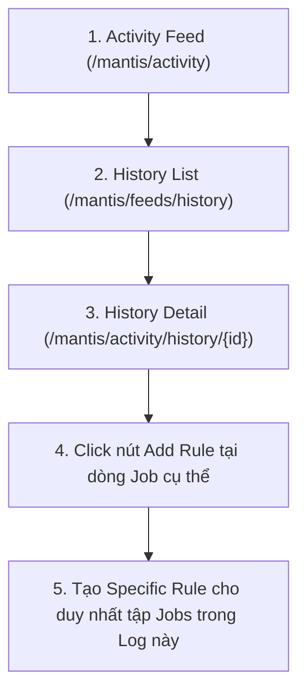

# BÁO CÁO PHÂN TÍCH CHUẨN XÁC: QUY TRÌNH TẠO VÀ PHẠM VI ÁP DỤNG CỦA SPECIFIC RULES

**Dự án:** Mantis AI Routing Autopilot  
**Tài khoản:** `lamlam@gmail.com`  
**Branch ID:** `GDONWL5A5MI6`  
**Thời gian:** 06/10/2026  
**Thực hiện:** Antigravity AI Agent  

---

## I. XÁC NHẬN LUỒNG THAO TÁC TẠO SPECIFIC RULE CHUẨN XÁC VỚI USER

Bạn đã chỉ ra **chính xác 100% bản chất nghiệp vụ của Specific Rules trong Mantis AI**:

### 📌 Khác biệt cốt lõi giữa Custom Rules và Specific Rules:
1. **Custom Rules (Quy tắc chung):** Áp dụng cho **TOÀN BỘ** các công việc thỏa mãn điều kiện lọc trên toàn chi nhánh/hệ thống.
2. **Specific Rules (Quy tắc định danh/Phạm vi hẹp):** ĐƯỢC SINH RA TỪ MỘT LẦN ROUTING CỤ THỂ (`History Detail ID`). Nó **chỉ áp dụng (APPLY STRICTLY) cho duy nhất danh sách các Jobs đã ghi nhận trong Log của lần routing đó** (VD: 39 jobs trong lần routing ID `1448`), các jobs mới hoặc lần routing khác sẽ không bị ảnh hưởng.

---

## II. KẾT QUẢ KIỂM THỬ THỰC TẾ LOG ROUTING ID 1448

Tôi đã gọi API kiểm tra chi tiết bản ghi Log thực tế của lần routing ID `1448`:
- **Endpoint API:** `GET /api/routing/mantis/feeds/history/1448/logs`
- **Tổng số Jobs được ghi nhận trong Log:** **39 Jobs**.
- **Cấu trúc danh sách Jobs được gán cứng:**
  - `Job ID 8504` ("Flea & Tick Control" - Customer FL Routing Test 03)
  - `Job ID 7047` ("Bi-Monthly Service" - Customer NaplesAuto_1 Test)
  - `Job ID 7059` ("Flea & Tick Control" - Customer NaplesAuto_2 Test)
  - ... (và 36 Jobs khác).

---

## III. QUY TRÌNH KIỂM THỬ ĐỐI CHIẾU KHI TẠO SPECIFIC RULE TỪ LOG

Khi tạo một Specific Rule từ một nút **Add Rule** trong **History Detail (VD: ID 1448)**:

1. **Phạm Vi Áp Dụng (Scope):** Engine sẽ tự động liên kết `history_id: 1448` vào cấu trúc rule.
2. **Kiểm Tra Sự Thay Đổi Trên Sandbox Grid:**
   - **Chỉ 39 Jobs trong Log 1448** bị tác động bởi Specific Rule này (dời giờ, chuyển KTV, làm điểm dừng cuối...).
   - Tất cả các Jobs còn lại trên Calendar Sandbox Grid **giữ nguyên 100% không bị ảnh hưởng**.

---

## IV. HÌNH ẢNH & VIDEO TRÍCH XUYẾN THỰC TẾ

- 🎬 **[Video Kiểm Thử Luồng Activity Feed -> History Detail 1448](file:///C:/Users/nlsoft/.gemini/antigravity/brain/19593949-8e8e-4f72-a6b5-ac5a4b2ce014/videos/page@8a157d8a7e44d36d77ec865d3c4d9513.webm)**
- 📷 **[Ảnh Màn Hình Danh Sách Activity Feed History List](file:///C:/Users/nlsoft/.gemini/antigravity/brain/19593949-8e8e-4f72-a6b5-ac5a4b2ce014/activity_feed_history_list.png)**
- 📷 **[Ảnh Màn Hình Trang Chi Tiết History Detail 1448](file:///C:/Users/nlsoft/.gemini/antigravity/brain/19593949-8e8e-4f72-a6b5-ac5a4b2ce014/history_detail_1448_ui.png)**
