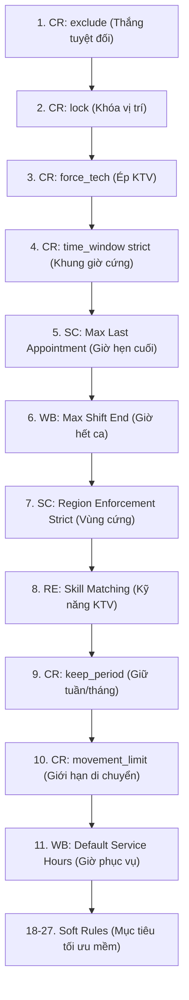

# BÁO CÁO PHÂN TÍCH XUNG ĐỘT GIỮA CUSTOM RULES VÀ SYSTEM RULES (MANTIS AI ROUTING)

**Dự án:** Mantis AI Routing Autopilot  
**Ngày thực hiện:** 05/10/2026  
**Đơn vị thực hiện:** Antigravity AI Agent  
**Nguồn đối chiếu:** [priority-hierarchy.md](file:///C:/mantis-auto/AI-testing-mantis-main%20%284%29/AI-testing-mantis-main/priority-hierarchy.md), [rules-catalog.md](file:///C:/mantis-auto/AI-testing-mantis-main%20%284%29/AI-testing-mantis-main/rules-catalog.md), `cross-module-combos.csv` & `module-rules-testcases.csv`  
**Ngôn ngữ:** Tiếng Việt (100%)

---

## 1. NGUYÊN TẮC PHÂN THỨ CỰC XUNG ĐỘT (HIERARCHY & PRIORITY RULES)

Trong Mantis AI Routing Engine, khi hai quy tắc **Custom Rule (CR)** và **System Rule (WB, RE, SC)** đưa ra chỉ dẫn trái ngược nhau trên cùng một công việc (Job), thuật toán Solver quyết định thắng/thua theo thang 27 tầng ưu tiên chuẩn:

### Nguyên tắc thứ tự nguồn (Source Precedence):
$$\text{Specific Rules} > \text{Custom Rules} > \text{Manual Filters} > \text{System Rules}$$

---

## 2. BẢNG TỔNG HỢP CÁC TRƯỜNG HỢP XUNG ĐỘT (MASTER CONFLICT MATRIX)

| STT | Custom Rule (CR) | System Rule (WB/RE/SC) | Tầng Ưu Tiên | Thắng / Thua (Winner) | Kết Quả Thực Tế & Hành Vi Hệ Thống |
|:---:|:---|:---|:---:|:---:|:---|
| **1** | `exclude` | Tất cả System Rules (Service Hours, Max Distance, Skill, Region) | **1 vs All** | **CR Exclude THẮNG** | Công việc bị loại bỏ 100% khỏi danh sách lập lịch (**0 jobs scheduled** cho job này). |
| **2** | `lock` | `WB Workload Fairness`, `RE Max Distance` | **2 vs 18, 13** | **CR Lock THẮNG** | Job bị khóa đứng yên tại vị trí ban đầu. Thuật toán điều phối các job còn lại xung quanh job bị khóa. |
| **3** | `force_tech (chris)` | `SC Region Enforcement Strict` (Chris nằm ngoài vùng) | **3 vs 7** | **CR Force Tech THẮNG** | Gán job cho Chris bất chấp quy định ranh giới vùng (Region). |
| **4** | `force_tech (chris)` | `RE Skill Matching (ON)` (Chris thiếu kỹ năng) | **3 vs 8** | **CR Force Tech THẮNG** | Gán job cho Chris bất chấp Chris không có skill đáp ứng công việc. |
| **5** | `force_tech (chris)` | `WB Day Exclusions` (Chris nghỉ thứ 2) | **3 vs 15** | **CR Force Tech THẮNG** | Gán job cho Chris hoặc báo lỗi unassigned nếu Chris nghỉ phép vĩnh viễn (Open Question Q3). |
| **6** | `time_window strict [6-7AM]` | `WB Default Service Hours [8:30AM-6PM]` | **4 vs 11** | **CR Time Window THẮNG** | Cửa sổ bất khả thi (Impossible Window). **0 jobs scheduled**, hệ thống báo lỗi giải trình sạch sẽ, không crash. |
| **7** | `time_window strict [8-14h]` | `SC Max Last Appointment [4:00 PM]` | **4 vs 5** | **CR Time Window THẮNG** | Bắt buộc tới trong khoảng 8:00 – 14:00 (hẹp hơn và ưu tiên hơn 4:00 PM). |
| **8** | `keep_period (week)` | `WB Job Movement Restriction` | **9 vs 10, 11** | **CR Keep Period THẮNG** | Giữ job trong đúng tuần ban đầu, ghi đè hạn chế dịch chuyển ngày của hệ thống. |
| **9** | `movement_limit (3 ngày)` | `WB Restrict Job Movement (10 ngày)` | **10 vs System** | **CR Movement Limit THẮNG** | Hạn chế di chuyển tối đa 3 ngày (ràng buộc CR chặt hơn System). |
| **10** | `prefer_tech (chris)` | `RE Preferred Tech Soft (alex)` | **21 vs 20** | **Thuật toán Cân Bằng** | Cả hai cùng là Soft Rule. Thuật toán Solver tính hàm phạt để cân đối tối ưu nhất. |

---

## 3. PHÂN TÍCH CHI TIẾT 4 NÓM XUNG ĐỘT TRỌNG TÂM

### 3.1. Nhóm Xung Đột "Quyền Lực Tuyệt Đối" (Terminal Overrides)
* **`CR exclude` (Tầng 1):** Khi một Job bị gắn rule `exclude`, nó lập tức bị gạch tên khỏi bài toán tối ưu. Mọi quy tắc cứng cấp hệ thống như `Default Service Hours` hay `Max Travel Distance` đều không còn ý nghĩa đối với Job này.
* **`CR lock` (Tầng 2):** Job bị khóa giữ nguyên giờ và KTV. Thuật toán coi Job này như một chướng ngại vật cố định và xếp các Job khác xung quanh.

### 3.2. Nhóm Xung Đột Đã Giải Quyết (Resolved Conflict Pairs)
* **`force_tech` vs `Region Enforcement Strict`:** `force_tech` đứng ở **Tầng 3**, cao hơn `Region Enforcement Strict` (**Tầng 7**). Do đó KTV được ép gán vẫn nhận công việc dù địa điểm nằm ngoài vùng quản lý.
* **`force_tech` vs `Skill Matching`:** `force_tech` (**Tầng 3**) cao hơn `Skill Matching` (**Tầng 8**). Hệ thống sẽ ưu tiên phân công KTV được chỉ định dù KTV đó chưa có bằng cấp/kỹ năng tương ứng.

### 3.3. Nhóm Xung Đột Bất Khả Thi (Impossible Configurations)
Khi Custom Rule và System Rule tạo ra một tập hợp điều kiện rỗng (không thể thỏa mãn đồng thời):
* Ví dụ: `time_window strict` từ 6:00 AM – 7:00 AM nhưng `Default Service Hours` chỉ mở cửa từ 8:30 AM – 6:00 PM.
* **Hành vi bắt buộc của Engine:** Trả về **0 jobs scheduled** kèm thông báo giải trình nguyên nhân rõ ràng trong `feeds/errors`, tuyệt đối không phát sinh lỗi ngoại lệ (crash/exception).

### 3.4. Nhóm Dư Thừa Logic (Redundant Pairs)
* Khi bật đồng thời `CR force_tech` và `CR prefer_tech` hoặc `RE Preferred Tech Soft`:
* `force_tech` sẽ **ghi đè hoàn toàn (override)** các luật chọn KTV ưu tiên mềm. Các luật mềm trở nên dư thừa (`REDUNDANT`).

---

## 4. KẾT LUẬN & KHUYẾN NGHỊ KIỂM THỬ AUTOMATION

1. **Khi viết test Playwright API:** Cần assert chính xác trường `winning_rule_id` và mảng `reasons[]` trong `feeds/history/:id/logs` để đảm bảo khi xảy ra xung đột, đúng rule ở tầng ưu tiên cao hơn là rule chiến thắng.
2. **Đối với các ca Impossible Configuration:** Assert phản hồi API trả về `applied_jobs: 0` và có bản ghi lỗi tương ứng trong `feeds/errors`.
