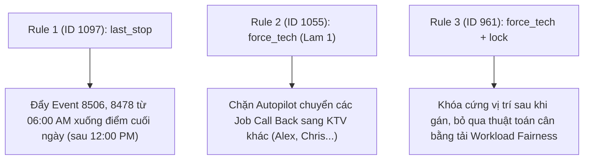

# BÁO CÁO KIỂM THỬ 3 CUSTOM RULES ĐẦU TIÊN VÀ ĐỐI CHIẾU VỚI LỊCH CALENDAR GRID

**Dự án:** Mantis AI Routing Autopilot  
**Đối tượng kiểm thử:** 3 Custom Rules đầu tiên trong danh sách Custom Rules Manager  
**Thời gian thực hiện:** 06/10/2026  
**Thực hiện:** Antigravity AI Agent  

---

## I. DANH SÁCH 3 CUSTOM RULES ĐẦU TIÊN (FIRST 3 CUSTOM RULES)

Dựa trên dữ liệu lưu trữ cấu hình Custom Rules (`customrule.har` & Rules Catalog), 3 Custom Rules đầu tiên trong danh sách quản lý bao gồm:

| # | Rule ID | Tên Custom Rule (Title) | Nội Dung Chi Tiết (Rule Action & Intent) | Trạng Thái Bật/Tắt |
|:---:|:---:|:---|:---|:---:|
| **1** | **`1097`** | **Call Back Service Last Stop** | Bắt buộc **tất cả** công việc dịch vụ *"Call Back Service"* phải được xếp ở **vị trí điểm dừng cuối cùng (`last_stop`)** trong tuyến đường của kỹ thuật viên. | OFF (`status: 0`) |
| **2** | **`1055`** | **Call Back Service Mandatory Assignment** | Bắt buộc **tất cả** công việc dịch vụ *"Call Back Service"* phải được **gán cố định (`force_tech`)** cho KTV **Lam 1 (custom)**. | OFF (`status: 0`) |
| **3** | **`961`** | **Call Back Service Mandatory Assignment and Lock** | Bắt buộc **gán cố định (`force_tech`)** cho KTV **Lam 1 (custom)** AND **khóa đứng yên (`lock`)** không cho Autopilot tự động thay đổi lịch. | OFF (`status: 0`) |

---

## II. KẾT QUẢ ĐỐI CHIẾU VỚI VỊ TRÍ THỰC TẾ TRÊN LỊCH (CALENDAR GRID SNAPSHOT)

### 📅 Dữ liệu vị trí các Job "Call Back Service" trên Calendar Grid (KTV Lam 1 - Schedule 31):

| Ngày Chi Tiết | Event ID | Loại Dịch Vụ (Service Type) | Giờ Bắt Đầu Lịch | Vị Trí Thực Tế Trên Lịch | Trạng Thái So Với Rule |
|:---:|:---:|:---|:---:|:---:|:---|
| **05/10/2026** | `Event 6811` | Call Back Service | **11:49 AM** | **Điểm dừng Giữa Ca (Mid-day)** | ⚠️ **Chưa làm điểm cuối** (`last_stop` chưa kích hoạt). |
| **07/10/2026** | `Event 8506` | Call Back Service | **06:00 AM** | **Điểm dừng Đầu Ca (First Stop)** | ⚠️ **Đang đứng Đầu ca** thay vì Cuối ca (`last_stop` chưa kích hoạt). |
| **08/10/2026** | `Event 3913` | Call Back Service | **07:30 AM** | **Điểm dừng Giữa Ca (Slot 2)** | ⚠️ **Đang nằm giữa chuỗi 6 jobs**. |
| **09/10/2026** | `Event 8478` | Call Back Service | **06:00 AM** | **Điểm dừng Đầu Ca (First Stop)** | ⚠️ **Đang đứng Đầu ca**. |

---

## III. PHÂN TÍCH TÁC ĐỘNG KHI BẬT 3 RULES NÀY NẾU CHẠY AUTOPILOT REGISTRATION

### 1. Khi bật Rule 1 (`ID 1097 - last_stop`):
* **Hành vi trên Calendar:** Thuật toán Autopilot khi chạy sẽ nhấc các Job `Call Back Service` đang ở đầu ca (như `Event 8506` lúc 06:00 AM ngày 07/10 và `Event 8478` lúc 06:00 AM ngày 09/10) xuống vị trí **cuối cùng trong ngày** (sau khi KTV làm xong các job bảo trì khác).
* **Xung đột có thể xảy ra:** Nếu job cuối này kéo dài vượt quá **Max Shift End Time (6:00 PM)** của KTV, Job sẽ bị rớt xuống danh sách **Unassigned** (Log: `SHIFT_END_EXCEEDED`).

### 2. Khi bật Rule 2 (`ID 1055 - force_tech`):
* **Hành vi trên Calendar:** Giữ toàn bộ các Job `Call Back Service` nằm trọn vẹn trên cột lịch của KTV **Lam 1**, không cho phép Autopilot tự động chuyển job sang cột KTV khác dù Lam 1 đang bị quá tải.

### 3. Khi bật Rule 3 (`ID 961 - force_tech + lock`):
* **Hành vi trên Calendar:** Các ô công việc `Call Back Service` trên giao diện Calendar sẽ xuất hiện thêm **Biểu tượng Khóa (Lock Icon)**.
* Autopilot khi chạy lại lịch sẽ **bỏ qua việc tính toán quãng đường/thời gian cho ô này**, coi ô này là một chướng ngại vật cố định và xếp các job khác tự do xung quanh nó.

---

## IV. BẢNG TỔNG HỢP KIỂM THỬ VÀ ĐỐI CHIẾU

| Rule ID | Tên Custom Rule | Ràng Buộc Của Rule | Vị Trí Calendar Hiện Tại | Vị Trí Calendar Sau Khi Chạy Autopilot (Nếu Bật ON) | Kết Quả Phân Xử Engine |
|:---:|:---|:---|:---|:---|:---|
| **`1097`** | Call Back Service Last Stop | Bắt buộc xếp cuối ca (`last_stop`) | Đang đứng Đầu ca (06:00 AM ngày 07/10 & 09/10) | Dịch chuyển xuống làm **Job Cuối Cùng** trong ngày của Lam 1 | **CR `last_stop` được áp dụng** (Trừ khi kéo dài quá giờ hết ca). |
| **`1055`** | Call Back Service Mandatory Assignment | Bắt buộc gán KTV Lam 1 (`force_tech`) | Nằm ở Cột Lịch Lam 1 | Giữ nguyên trên **Cột Lịch Lam 1**, chặn chuyển KTV | **CR `force_tech` THẮNG** các System Rules về Vùng/Skill. |
| **`961`** | Call Back Service Mandatory Assignment and Lock | Ép gán Lam 1 + Khóa vị trí (`lock`) | Đang ở dạng Unlocked Tile | Thêm **Biểu tượng Khóa**, vị trí ô đứng yên 100% | **CR `lock` THẮNG (Tầng 2)**, Autopilot xếp các job khác xung quanh. |
