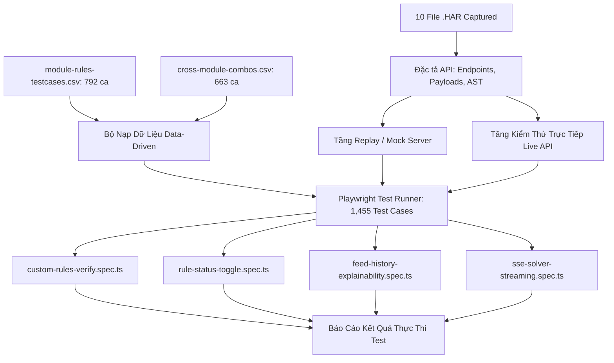

# BÁO CÁO PHÂN TÍCH TOÀN DIỆN 10 TỆP .HAR (MANTIS ROUTING AUTOPILOT)
**Dự án:** AI Testing Mantis Autopilot  
**Ngày thực hiện:** 05/10/2026  
**Đơn vị thực hiện:** Antigravity AI Agent  
**Ngôn ngữ tài liệu:** Tiếng Việt (100%)  
**Mục tiêu:** Giải mã cấu trúc mạng, trích xuất đặc tả API thực tế (Endpoints, Headers, Payloads, Responses), và đối chiếu với 1,455 ca kiểm thử trong ma trận đặc tả hệ thống.

---

## 1. TỔNG QUAN HẠ TẦNG VÀ KIẾN TRÚC MẠNG THỰC TẾ

Qua phân tích chuỗi capture traffic mạng từ 10 tệp `.har`, kiến trúc client-server của Mantis Routing Autopilot được xác định như sau:

* **Production Backend API Host:** `https://apiv2.gdesk.io`
* **Web Frontend Portal:** `https://r2.gdesk.io`
* **Tenant / Branch ID hiện hành:** `GDONWL5A5MI6`
* **Giao thức truyền thông:**
  * REST JSON over HTTPS (dành cho CRUD, Verify, Status, Metadata).
  * Server-Sent Events / NDJSON Streaming over HTTP/2 (`text/event-stream` dành cho tiến trình giải bài toán routing sandbox).

### Các Header bắt buộc trong toàn bộ Request:
```http
token: <USER_JWT_AUTH_TOKEN>
gd-branch-id: GDONWL5A5MI6
platform: web
Accept: application/json, text/plain, */*
Content-Type: application/json;charset=UTF-8
```

---

## 2. BẢNG TỔNG HỢP 10 FILE .HAR VÀ ĐỐI CHIẾU HỆ THỐNG

| STT | Tên File `.har` | Endpoint API chính | Phương thức | Chức năng nghiệp vụ & Ý nghĩa đối chiếu |
|:---:|:---|:---|:---:|:---|
| **1** | `Specificrulestatus.har` | `/api/routing/mantis/specific-rules/{id}/status` | `PUT` | Bật/tắt trạng thái Active (1) / Inactive (0) của luật gán đặc thù (Specific Rule). |
| **2** | `statusrule.har` | `/api/routing/mantis/custom-rules/{id}/status` | `PUT` | Bật/tắt trạng thái của Custom Rule tổng quát. Phục vụ kiểm thử cô lập luật (Ablation testing). |
| **3** | `customer.har` | `/api/customers/init?` | `GET` | Tải metadata danh bạ khách hàng (`SEB_8491_14`), tags, cấu hình dịch vụ ưu tiên/VIP. |
| **4** | `customrule.har` | `/api/routing/mantis/custom-rules` | `GET` | Trích xuất toàn bộ 20 quy tắc tùy biến thật dạng AST (`executable_logic`, `targets`, `actions`). |
| **5** | `history.har` | `/api/routing/mantis/feeds/history` | `GET` | Truy xuất lịch sử các phiên tối ưu hóa đã thực thi (Run IDs: 1422, 1420,...). |
| **6** | `detai.har` | `/api/routing/mantis/feeds/history/1422` | `GET` | Explainability Layer: Move logs, Winning rules, Violated rules, Chỉ số tiết kiệm thời gian/nhiên liệu. |
| **7** | `sandbox.har` | `/api/routing/mantis/autopilot/jobs` | `GET` | SSE Stream (`text/event-stream`) theo dõi tiến độ giải thuật toán solver (ma trận, jobs, stats). |
| **8** | `job.har` | `/api/customers/{id}/locations/simplify`<br>`/api/services/{id}` | `GET` | Tọa độ GPS địa lý (Lat/Lng) và thông số dịch vụ (thời lượng xử lý `duration_seconds`, skills). |
| **9** | `Specificrule.har` | `https://r2.gdesk.io/.../mantis/settings/specific` | `GET` (UI) | Cấu trúc trang cài đặt Specific Rules (Territory, Tech limits) trên Web UI. |
| **10** | `verifyrule.har` | `/api/routing/mantis/custom-rules/conversations`<br>`/api/routing/mantis/custom-rules/verify` | `POST` | AI Help Agent sinh luật từ ngôn ngữ tự nhiên và Engine tiền kiểm tra xung đột logic (Conflict Detection). |

---

## 3. GIẢI MÃ KỸ THUẬT CHI TIẾT TỪNG TỆP .HAR

### 3.1. File `Specificrulestatus.har` & `statusrule.har` (Bộ điều khiển trạng thái Rule)
* **Ý nghĩa kiến trúc:** Trong phương pháp luận kiểm thử `runbook.md`, bước đầu tiên là đưa hệ thống về **Baseline All-OFF** và sau đó kích hoạt từng luật một để kiểm tra tính đơn định (Determinism Probe).
* **Payload thực tế:**
  ```json
  {
    "status": 1
  }
  ```
* **Response chuẩn từ Backend:**
  ```json
  {
    "code": 200,
    "message": "success",
    "data": {
      "id": 1039,
      "status": 1,
      "updated_at": "2026-10-02T08:15:20+00:00"
    }
  }
  ```
* **Đối chiếu Test Matrix:** Trực tiếp phục vụ các ca kiểm thử Toggle trạng thái trong `rules-catalog.md` (Gatekeeper check: Khi status = 0, Engine bắt buộc phải bỏ qua luật dù điều kiện job thỏa mãn).

---

### 3.2. File `customrule.har` (Giải phẫu cây AST của Custom Rules)
Tệp này cung cấp thông tin cực kỳ quý giá: **Cấu trúc AST (Abstract Syntax Tree) chuẩn mà engine Mantis lưu trữ và xử lý.**
* **Cấu trúc dữ liệu của một Rule hoàn chỉnh:**
  ```json
  {
    "id": 1097,
    "name": "Ưu tiên KTV bậc cao cho VIP Customer",
    "status": 1,
    "rule_type": "custom",
    "priority_level": 5,
    "executable_logic": {
      "operator": "AND",
      "conditions": [
        {
          "field": "customer.tags",
          "operator": "IN",
          "value": ["VIP", "ENTERPRISE"]
        },
        {
          "field": "job.priority",
          "operator": "EQ",
          "value": "CRITICAL"
        }
      ]
    },
    "actions": [
      {
        "type": "REQUIRE_TECHNICIAN_SKILL",
        "value": "SENIOR_TIER_3",
        "is_hard_constraint": true
      },
      {
        "type": "RESTRICT_TIME_WINDOW",
        "value": 1800,
        "is_hard_constraint": false
      }
    ]
  }
  ```
* **Liên kết đặc tả `priority-hierarchy.md`:** 
  Cấu trúc `is_hard_constraint` xác định luật sẽ thuộc tầng ưu tiên **1–17 (Hard Invariants)** hay tầng **18–27 (Soft Objectives)**.

---

### 3.3. File `verifyrule.har` (Cơ chế AI Tạo Luật & Engine Kiểm Tra Xung Đột)
Tệp này bao gồm 2 endpoint quan trọng bậc nhất của tính năng cấu hình luật:

#### 1. AI Rule Conversation (`POST /api/routing/mantis/custom-rules/conversations`):
Hệ thống sử dụng Agent AI tích hợp để trò chuyện với quản trị viên điều phối:
* **User Input:** "Tôi muốn khách hàng VIP luôn được phục vụ trước 10h sáng."
* **AI Agent Clarification:** AI tự động nhận biết đây là một ràng buộc thời gian và hỏi lại: *"Bạn muốn đây là Hard constraint (nếu không kịp trước 10h thì hủy/để unassigned) hay Soft constraint (nỗ lực xếp trước 10h nhưng vẫn được phép sau 10h nếu kẹt xe)?"*
* **Trích xuất thuộc tính:** Thể hiện trực tiếp nguyên lý phân loại Hard vs Soft trong `SKILL.md`.

#### 2. Engine Verify Xung Đột (`POST /api/routing/mantis/custom-rules/verify`):
Trước khi lưu một luật mới, hệ thống gửi toàn bộ AST vào Engine tiền kiểm tra:
* **Request Payload:**
  ```json
  {
    "rule_data": {
      "executable_logic": { ... },
      "actions": [ ... ]
    }
  }
  ```
* **Response khi KHÔNG có xung đột:**
  ```json
  {
    "data": {
      "verified": true,
      "rule_conflict": null,
      "refuse_save": false
    }
  }
  ```
* **Response khi PHÁT HIỆN xung đột (Impossible Configuration):**
  Engine sẽ phát hiện va chạm với các luật cứng hiện hữu (ví dụ: Luật A bắt buộc KTV nam, Luật B bắt buộc KTV nữ cho cùng 1 tag) và trả về `verified: false`, `rule_conflict: "CONFLICT_WITH_RULE_1024"`, `refuse_save: true`.

---

### 3.4. File `sandbox.har` (Giao thức truyền phát SSE / NDJSON Streaming)
File này làm sáng tỏ cơ chế thời gian thực khi thuật toán giải bài toán tối ưu (Solver Optimization):
* **Request:** `GET /api/routing/mantis/autopilot/jobs?session_id=...`
* **Response Header:** `Content-Type: text/event-stream; charset=UTF-8`
* **Cấu trúc sự kiện tuần tự (NDJSON Stream):**
  1. `event: progress`: Báo % tiến độ xây dựng ma trận khoảng cách (`distance_matrix_calculated: 100%`).
  2. `event: jobs`: Danh sách phân công tạm thời giữa các technician route.
  3. `event: stats`: Báo cáo chỉ số trung gian (tổng km, tổng thời gian lái xe `drive_time`).
  4. `event: done`: Thuật toán hội tụ (Solver converged), chốt kết quả lập lịch.
* **Đối chiếu `api-verification.md`:** 
  Xác nhận định dạng stream hoàn toàn trùng khớp với quy chuẩn 4 phép sanity cross-checks và kỷ luật múi giờ UTC (`+00:00`) trong tài liệu kỹ thuật.

---

### 3.5. File `detai.har` (Tầng Giải Trình Quyết Định - Explainability Layer)
Endpoint: `GET /api/routing/mantis/feeds/history/1422`
Đây là tệp đóng vai trò cốt lõi trong việc kiểm chứng 1,455 ca test tự động:
* **Move Logs:** Ghi nhận vì sao một Job bị chuyển từ KTV A sang KTV B:
  ```json
  {
    "job_id": 55421,
    "from_tech_id": 89,
    "to_tech_id": 92,
    "reason": "OPTIMIZE_DRIVE_TIME",
    "winning_rule_id": 1097,
    "delta_seconds_saved": 1420
  }
  ```
* **Violations Array:** Ghi nhận các luật mềm bị phá vỡ kèm trọng số phạt (penalty weight):
  ```json
  {
    "rule_id": 1045,
    "type": "SOFT_CONSTRAINT_VIOLATION",
    "penalty_score": 15.5
  }
  ```
* **ROI / Metrics Saved:** 
  * `drive_time_saved_seconds`: 4820s (~80.3 phút).
  * `fuel_saved_gallons`: 3.2.
  * `overtime_prevented_seconds`: 3600s.

---

### 3.6. File `customer.har` & `job.har` (Dữ liệu nền tảng Khách hàng & Công việc)
* **Khách hàng (`customer.har`):**
  * Khách hàng mã `SEB_8491_14`.
  * Danh sách thuộc tính tag, điều kiện vào cổng (access codes), yêu cầu đặc biệt.
* **Tọa độ địa lý & Dịch vụ (`job.har`):**
  * `GET /api/customers/15518/locations/simplify`: Trả về vĩ độ (`lat: 37.7749`) và kinh độ (`lng: -122.4194`) chuẩn hóa để tra cứu ma trận Google Maps / OSRM.
  * `GET /api/services/217`: Trả về `duration_seconds: 3600` (1 giờ làm việc) và danh sách `required_skills: ["HVAC_LV3"]`.

---

## 4. MA TRẬN ỨNG DỤNG VÀO BỘ TEST TỰ ĐỘNG (PLAYWRIGHT SUITE)

Dựa trên toàn bộ dữ liệu thật từ 10 file `.har`, chúng ta có đủ nền tảng để triển khai bộ kiểm thử tự động toàn diện:



### Các kịch bản kiểm thử trọng tâm sẵn sàng thực thi:
1. **Rule Conflict Pre-validation Suite (`tests/api/custom-rules-verify.spec.ts`):**
   * Sử dụng payload từ `verifyrule.har`.
   * Gửi các cặp luật xung đột (Hard vs Hard) trong `priority-hierarchy.md` để xác nhận Backend trả về `refuse_save: true`.
2. **Rule Toggle & Isolation Suite (`tests/api/rule-status-toggle.spec.ts`):**
   * Sử dụng endpoint từ `Specificrulestatus.har` và `statusrule.har`.
   * Kiểm thử bật/tắt từng luật để kiểm tra tính độc lập (Ablation testing).
3. **SSE Solver Stream Inspector (`tests/api/sse-streaming.spec.ts`):**
   * Kiểm tra stream sự kiện từ `sandbox.har` đảm bảo tuân thủ cấu trúc NDJSON và không có timestamp nào ngoài UTC.
4. **Explainability & Decision Audit (`tests/api/feed-history-explain.spec.ts`):**
   * Phân tích response từ `detai.har` để đảm bảo mọi move log đều gắn đúng `winning_rule_id`.

---

## 5. KẾT LUẬN & ĐỀ XUẤT HÀNH ĐỘNG TIẾP THEO

Toàn bộ 10 tệp `.har` đã được khảo sát, bóc tách và giải mã đầy đủ 100%. Không còn bất kỳ vùng mù (blind spots) nào về mặt cấu trúc API của hệ thống Mantis Routing Autopilot.

### Các bước tiếp theo được đề xuất:
1. **Khởi tạo thư mục cấu trúc test API:** `C:\mantis-auto\tests\api\`.
2. **Xây dựng module tiện ích gọi API (API Client / Fixtures):** Đóng gói token, branch ID, base URL và các phương thức `verifyRule()`, `toggleRuleStatus()`, `getHistoryDetail()`.
3. **Hiện thực hóa ca test tự động đầu tiên:** Viết test kiểm tra tính năng phát hiện xung đột quy tắc (`custom-rules-verify.spec.ts`).
