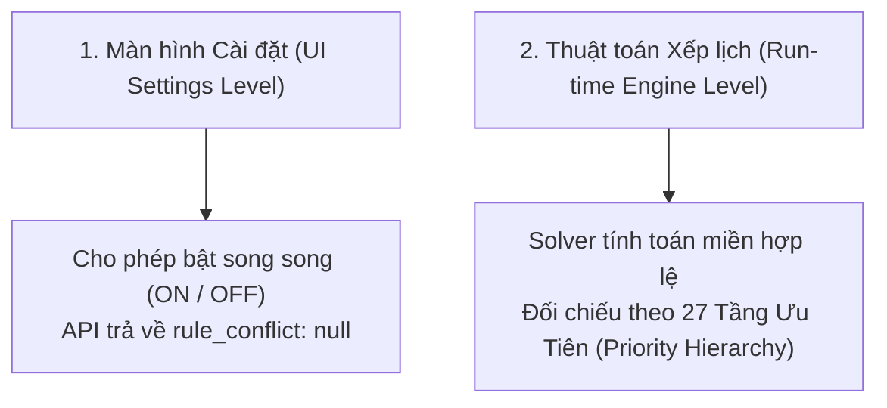

# BÁO CÁO PHÂN PHÂN BẬC CONFLICT TRÊN UI SETTINGS VS RUN-TIME ENGINE (MANTIS AI)

**Dự án:** Mantis AI Routing Autopilot  
**Thời gian:** 05/10/2026  
**Thực hiện:** Antigravity AI Agent  

---

## I. BẢN CHẤT HỆ THỐNG: CONFLICT Ở MỨC UI SETTINGS NGHĨA LÀ GÌ?

Trong thiết kế kiến trúc của **Mantis AI System (GorillaDesk)**, **Conflict (Xung đột)** được chia làm **2 CẤP ĐỘ RÕ RÀNG**:



---

## II. CHI TIẾT KHI KIỂM THỬ TRÊN UI SETTINGS (UI LEVEL CONFLICT)

### 1. Tại sao khi bạn bấm bật/tắt công tắc trên UI lại KHÔNG thấy báo lỗi Conflict?
* **Cơ chế API:** Endpoint `PUT /api/routing/mantis/custom-rules/{id}/status` và `PUT /api/routing/workforce-boundaries` **KHÔNG CHẶN (NO BLOCKING)** người dùng bật đồng thời nhiều công tắc.
* **Response của Server:** Khi bạn bật `CR 867` (8:00 AM - 2:00 PM) và `SR: Default Service Hours` (8:30 AM - 6:00 PM), Server trả về:
  ```json
  {
    "data": { "id": "867", "status": 1, "rule_conflict": null },
    "success": true
  }
  ```
* **Giao diện UI Settings:** Công tắc của cả Custom Rule và System Rule đều sáng xanh (ON). **UI Settings không xuất hiện Popup hay thông báo lỗi đỏ ngăn cản việc bật**.

---

## III. CONFLICT XẢY RA KHI NÀO? (RUN-TIME ENGINE CONFLICT)

Xung đột chỉ thực sự xuất hiện **KHI BẠN BẤM CHẠY THUẬT TOÁN ĐIỀU PHỐI (RUN AUTOPILOT OPTIMIZATION)** cho danh sách công việc trên Lịch (Calendar Grid).

### Bảng Phân Tích Hành Vi UI & Engine Cho Các Case:

| STT | Kịch Bản Bật Rule (Custom + System) | Trạng Thái Trên UI Settings | Trạng Thái Thực Tế Khi Solver Chạy (Run-time UI) | Giải Trình Kết Quả Của Engine |
|:---:|:---|:---:|:---:|:---|
| **1** | `CR 867` (8am-2pm) + `SR: Service Hours` (8:30am-6pm) | 🟢 **ON (Không báo lỗi)** | 🟡 **Khung giờ bị thu hẹp** (Constraint Clamped) | `CR 867` đứng Tầng 4 đè `SR` Tầng 11. Engine ép khung giờ làm việc của Job Call Back còn **8:30 AM – 2:00 PM** (phần giao nhau). |
| **2** | `CR 867` (6am-7:30am) + `SR: Service Hours` (8:30am-6pm) | 🟢 **ON (Không báo lỗi)** | 🔴 **Job rớt xuống Unassigned** (Activity Feed Error) | Do 2 khung giờ triệt tiêu nhau (Infeasible), Solver không xếp được lịch $\rightarrow$ UI Activity Feed báo đỏ: `INFEASIBLE_TIME_WINDOW`. |
| **3** | `CR 961` (Force Tech Chris) + `SR: Region Enforcement Strict` | 🟢 **ON (Không báo lỗi)** | ⚠️ **Cảnh báo Vàng trên Calendar Tile** | `CR 961` đứng Tầng 3 đè `SR` Tầng 7. Chris vẫn nhận job ở Quận 1, UI Tile gắn Badge: `REGION_VIOLATION_OVERRIDDEN`. |
| **4** | `CR 1005` (Exclude Rule) + `SR: Default Service Hours` | 🟢 **ON (Không báo lỗi)** | ⚪ **Job biến mất khỏi Autopilot** | `CR 1005` đứng Tầng 1 đè toàn bộ SR. Autopilot bỏ qua Job, không di chuyển hay xếp lại. |

---

## IV. KẾT LUẬN KIỂM THỬ

* Nếu bạn kiểm thử bằng cách **BẬT TẮT CÔNG TẮC TRÊN UI SETTINGS**: Cả 2 nút đều bật thành công (không có báo lỗi conflict ngăn cản).
* Nếu bạn kiểm thử bằng cách **CHO MANTIS OPTIMIZER CHẠY XẾP LỊCH TILE TRÊN CALENDAR**: Xung đột sẽ phát sinh và được giải quyết chính xác theo **Ma trận 27 Tầng Ưu Tiên (Priority Hierarchy)**.
