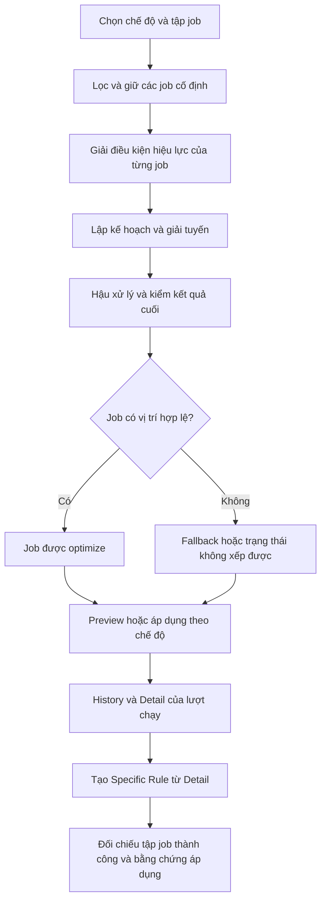

# Phân tích sâu 9 mục của bản đồ luật Mantis

Ngày đối chiếu: 03/10/2026. [Artifact nguồn](https://claude.ai/artifact/NfFGXJFZ4HStmmuNV2msyK).

**Cập nhật xác nhận:** người dùng đã xác nhận toàn bộ 9 mục của artifact. Dùng nội dung đã xác nhận làm chuẩn nghiệp vụ khi chấm test; không hỏi xác nhận lại các mục này. Các xác nhận cụ thể trực tiếp trong hội thoại, đặc biệt phạm vi specific rule theo tập job optimize thành công trong log, vẫn được giữ. Các ca test chưa chạy vẫn là kế hoạch; xác nhận yêu cầu không đồng nghĩa đã xác minh implementation.

Hai xác nhận trực tiếp của người dùng được dùng làm chuẩn:

1. Specific rule lấy phạm vi là các job optimize thành công xuất hiện trong log của lượt optimize. Ví dụ chọn 10 job nhưng chỉ 8 được optimize và ghi vào log thì specific rule áp dụng trên tập 8 job này.
2. Job ở fallback day được miễn hard rule.

Ưu tiên dùng khi kiểm thử theo mục đã xác nhận: **specific > custom > Manual filter > system**. Với specific và custom cùng loại hành động, kiểm specific có ghi đè đúng phạm vi; không coi việc bị chặn conflict là mặc nhiên đúng chỉ vì implementation hiện trả như vậy.

## 1. Bức tranh tổng thể: tách nguồn luật, tập job và hành vi

### Bốn loại nguồn không phải bốn bước nối tiếp đơn giản

| Nguồn | Phạm vi cần xác định | Điều cần kiểm trước khi đánh giá kết quả |
|---|---|---|
| System | Thiết lập công ty tại thời điểm chạy | Giá trị, trạng thái bật/tắt và chế độ chạy thực tế |
| Custom | Các job khớp bộ lọc của rule | Logic đã biên dịch, `match: all/any`, trạng thái hiệu lực, xung đột |
| Specific | Tập job optimize thành công của lượt log theo xác nhận người dùng | History ID, tập event/job ID, liên kết rule với lượt đó và điều kiện trong rule |
| Manual filter | Những lựa chọn cho một lượt chạy tay | Trường nào chỉ chọn dữ liệu, trường nào thực sự ghi đè hành vi |

Số **66 luật** trên artifact là số loại quy tắc/hành vi trong tài liệu. Số **122 custom rule** của audit là số bản ghi cấu hình cụ thể; nhiều bản ghi có thể sử dụng cùng một hành động. Không đối chiếu hai con số như thể có rule bị thiếu.

### Điểm phải giữ đúng cho specific rule

Artifact mô tả F1 theo một job và recurrence; người dùng xác nhận luồng hiện dùng lấy tập job thành công trong log. Hai cách mô tả chưa đủ để suy ra cùng một mô hình lưu trữ. Có thể một thao tác tạo rule tạo một bản ghi cho cả tập, hoặc tạo nhiều liên kết; HAR hiện tại chưa chứng minh cấu trúc nào.

Chuẩn kiểm thử hiện dùng là phạm vi do người dùng xác nhận. Cần request tạo rule để biết backend truyền `history_id`, `optimization_id`, event ID hay một khóa liên kết khác. Không tự chọn tên trường payload từ suy đoán.

Với History **1422**, có đủ 30 job 8543–8572 của custom, đều được ghi `optimized`, không có `unassigned`. Vì thế tập nguồn ở lượt này là 30 job. Điều này không có nghĩa mọi history đều có 30 job, hoặc mọi job đầu vào đều được đưa vào specific rule.

### Cách chứng minh một rule hoạt động

Phải trả lời lần lượt:

1. Job có thuộc tập nguồn của lượt chạy không?
2. Job có khớp điều kiện của rule không?
3. Rule có thực sự active, hay bị conflict?
4. Có rule ưu tiên cao hơn thay thế điều kiện này không?
5. Job được xếp tuyến bình thường, giữ cố định, bị loại hay đưa ra fallback?
6. Kết quả cuối cùng có thỏa điều kiện hiệu lực không?

Một phản hồi `success = true` ở API bật rule chỉ trả lời một phần bước 3. Một job có mặt trên calendar cũng chưa trả lời được bước 5.

## 2. Flow một lần chạy: phải kiểm ở đúng thời điểm

Sơ đồ là cấu trúc kiểm tra. HAR hiện có chưa cho biết sau khi lưu specific rule cần optimize lại, refresh log hay gọi một thao tác apply riêng để có kết quả mới. Đây là chi tiết còn phải lấy từ bản ghi tạo/lưu.

### Bằng chứng cần lưu ở từng chặng

| Chặng | Dữ liệu tối thiểu | Sai lầm cần tránh |
|---|---|---|
| Trước chạy | Cấu hình system, rule active, job/event ID, lịch và giờ gốc | Dùng cấu hình của lần chạy cũ để chấm lần mới |
| Chọn job | Tập đầu vào và lý do loại từng job | Coi mọi job trên schedule là cùng thuộc run |
| Giải rule | Các rule khớp, rule bị chặn, giá trị cuối | Thấy rule tồn tại là coi đã được áp dụng |
| Solver và hậu xử lý | Ngày/tech ứng viên, lựa chọn, lý do thiếu chỗ, stage thay đổi | Chỉ kiểm output solver mà bỏ kết quả sau hậu xử lý |
| Preview | Tập job được xử lý, job cố định, helper, fallback | Dùng một mình `is_routing` để phân loại |
| Accept hoặc áp dụng | ID phương án, trạng thái lưu, lịch đọc lại | Coi preview là lịch thực tế đã thay đổi |
| History | Run ID, before/after, từng job và rule attribution | Lấy History khác lượt để chứng minh rule hiện tại |

### Đối chiếu dữ liệu đang có

- Audit 122 rule chạy Sandbox; không có thao tác Accept từ trình audit. Đã đọc lại lịch thực tế và khôi phục trạng thái rule.
- History 1422 là một lượt `manual_optimize` có trạng thái bằng chứng `accepted`, mã `opt_sandbox_342cb4e0648043c16702773a39a06bab`.
- Hai nguồn này không phải cùng lượt. Không ghép thiết lập của audit vào History 1422 để suy ra lỗi.
- History có `period = 04–08/10`, nhưng bộ giải xem các ngày 03–17/10 và kết quả có ngày 10/10, 13/10. Cần phân biệt khoảng chọn dữ liệu với khoảng được phép xếp kết quả.

### Ca test cho flow

- Chụp lịch trước/sau Preview: không có thay đổi ngoài dự kiến.
- Thay đổi một job sau Preview rồi Accept: kiểm cơ chế phát hiện phương án cũ, dựa trên yêu cầu freshness đã chốt.
- Gửi lại cùng thao tác Accept: không cộng metric hoặc tạo dịch chuyển hai lần.
- Với Specific Rule: xác nhận log nguồn trước, tạo rule từ đúng Detail, rồi thu log/response sau thao tác để xác định cơ chế áp dụng thực tế.

## 3. Phân loại luật: chọn cách chấm theo bản chất

### Không dùng một công thức PASS/FAIL cho mọi loại

| Nhóm hành vi | Điều được chấm | Bằng chứng cần thêm |
|---|---|---|
| Lọc | Đúng job được tham gia hoặc bị loại | Tập nguồn và lý do loại |
| Giữ cố định | Ngày, giờ, tech và khoảng chiếm chỗ | Lịch của các job lân cận |
| Hard | Điều kiện cuối cùng của job trong tuyến | Phạm vi hiệu lực, xung đột, fallback |
| Soft | Có lựa chọn hợp lệ tốt hơn hay không | Khả năng nhận việc, phương án thay thế, thứ tự ưu tiên |
| Chiến lược | Chất lượng phân cụm/phân bổ theo mục tiêu | Cùng dữ liệu đầu vào, cùng ma trận và cấu hình |
| Sau áp dụng/hiển thị | Arrival window, metric, giá trị được lưu | Đọc lại sau Accept hoặc sau thao tác lưu tương ứng |

### Custom rule: các họ hành động cần đi sâu

| Họ hành động | Kiểm tra chính | Kiểm tra sát biên hoặc kết hợp |
|---|---|---|
| `keep_period` | So sánh ngày/tuần/tháng gốc và mới | Qua Chủ nhật, cuối tháng, cuối năm; trước hết xác định fallback |
| `movement_limit` | Độ lệch ngày lịch tuyệt đối | N = 0; đúng N; N+1; dịch sớm và dịch muộn |
| `force_tech` | Tech được ép và tech thực tế | A6 bật/tắt, tech không có ca, giao cùng tech đang giữ, helper |
| `prefer_tech` | Ưu tiên được xét khi có khả năng đáp ứng | Preferred rỗng, preferred hết ca, hai ưu tiên mâu thuẫn |
| `time_window` strict | Giờ đến hoặc toàn job theo yêu cầu đã chốt | Đúng đầu/cuối window; trước/sau 1 phút; giao với giờ làm rỗng |
| `time_window` soft | Mức ưu tiên và phương án khả thi khác | Không kết luận lỗi chỉ vì giờ cuối khác khoảng ưa thích |
| Arrival window | Khoảng giờ thông báo được lưu/hiển thị | Không tự dùng duration thông báo làm thời lượng dịch vụ |
| `first_stop` / `last_stop` | Thứ tự trên tuyến hợp lệ cuối cùng | Anchor, helper, nhiều job cùng bắt đầu, nhiều rule tranh đầu/cuối |
| `lock` | Vị trí và khoảng chiếm chỗ giữ đúng | Ngoài ca; trùng job khác; đi cùng exclude hoặc force |
| `exclude` | Job bị loại toàn bộ hay cấm tổ hợp tech/ngày | Cần tách loại trừ toàn bộ với loại trừ có điều kiện |
| `drive_buffer` | Chặng nào nhận buffer, có cộng hai lần không | Job đầu, depot, time off, B8 bật/tắt |
| Giới hạn travel | Đúng tập chặng và đơn vị | Cap = 0; đúng ngưỡng; quá ngưỡng; depot và buffer |

Trong dữ liệu live đã đọc có 13 loại action khác nhau. Artifact không mở đầy đủ nội dung từng điều trong RULE_CONTRACT; không thể từ bảng tổng hợp tự suy ra toàn bộ schema 66 luật.

### Specific rule: phạm vi nguồn và phạm vi tác động

Tập nguồn là job optimize thành công trong history. Sau đó phải đối chiếu điều kiện của rule và khả năng backend gắn rule với event/job/series.

Ví dụ kiểm tra quan trọng nhất:

- Đầu vào: 10 job.
- Kết quả: 8 job thành công, 2 job không thành công.
- Tạo rule từ Detail của lượt này.
- Xác nhận rule liên kết đúng tập 8 job.
- Xác nhận 2 job ngoài tập không bị thay đổi do specific rule đó.
- Trong 8 job, kiểm job nào thỏa bộ lọc, được ghi applied và có kết quả đúng.

Không dùng `jobs_count`, `moved` hoặc `is_routing` đơn lẻ để thay cho danh sách tối ưu thành công. Fallback có thể vẫn xuất hiện trên lịch; danh sách cần được dựng từ trạng thái thành công và liên kết của chính lượt đó.

## 4. Thứ tự ưu tiên: tách lúc kích hoạt và lúc thực thi

Một rule có thể chưa tới bước chạy vì bị conflict lúc kích hoạt. Khi đó không thể dùng output để chứng minh rule ở tầng cao hơn đã thua trong solver.

Artifact nêu thứ tự ưu tiên nguồn và các khác biệt cần đối chiếu giữa tài liệu/implementation. Sau xác nhận cả 9 mục, dùng thứ tự nguồn đã xác nhận để chấm; vẫn kiểm riêng trạng thái kích hoạt và kết quả thực thi:

| Tình huống | Câu hỏi ở lúc bật/lưu | Câu hỏi khi thực thi |
|---|---|---|
| Specific và custom cùng `movement_limit` | Cùng tồn tại active hay specific bị conflict? | Giá trị nào có hiệu lực cho đúng job trong log? |
| Custom force Lam, specific force Lam 1 | Có cho lưu hai rule không? | Tech cuối cùng theo nguồn nào? |
| Custom strict window và system hours | Có bị chặn khi giao rỗng không? | Nếu được chạy, tìm ngày khác hay fallback? |
| Force tech và A6 OFF | Có status 2/khóa rule không? | Job cùng tech và job khác tech có hành vi khác nhau không? |
| Lock và ưu tiên mềm | Rule nào còn được xét? | Job có giữ vị trí, job khác có né đúng không? |

### Quan sát live đã xác minh

23 custom rule bị trả `status = 2` sau khi yêu cầu bật. Chi tiết cả 23 rule ghi xung đột với `system_rules.allow_cross_technician_routing`; thiết lập lúc audit là 0.

Đây là bằng chứng về cơ chế chặn của bản đang chạy. Nó không tự chứng minh cơ chế đó đúng yêu cầu sản phẩm, vì artifact cũng liệt kê xung đột X08 về cách xử lý Force Technician khi A6 OFF.

Rule 1055 vẫn giữ status 2 sau ba lần đọc: ngay sau bật, sau 5 giây và sau thêm 10 giây. Do đó không nên giải thích đơn giản là chỉ cần chờ trạng thái bật cập nhật.

### Bộ test phân xử custom/specific

| ID | Thiết lập | Điều cần xác nhận |
|---|---|---|
| P01 | Custom ±10 ngày, specific ±1 ngày trên cùng tập | Specific ghi đè hay conflict; job ngoài tập vẫn theo custom |
| P02 | Đảo thứ tự tạo P01 | Thứ tự tạo có làm thay đổi ưu tiên nguồn không? |
| P03 | Hai rule cùng loại, cùng giá trị | Có conflict dù kết quả không khác không? |
| P04 | Custom force Lam, specific force Lam 1 | Bật A6 trước để không lẫn xung đột hệ thống |
| P05 | Tắt specific sau P04 | Custom có trở lại hiệu lực đúng không? |
| P06 | Tắt custom, chỉ specific active | Xác minh specific độc lập và tập job nguồn |
| P07 | Rule không liên quan service/customer | Không làm thay đổi bộ điều kiện của nhóm đối chứng |
| P08 | Bật A6, tạo force, sau đó tắt A6 | Rule cũ đổi trạng thái hay chỉ thay đổi hành vi chạy? |

P01–P03 dùng tiêu chí specific ưu tiên hơn custom trong đúng phạm vi. Cần chạy thử để xác minh implementation; lượt review chưa sửa system hoặc tạo các rule này.

## 5. Ma trận B8: phải dùng cùng tập chặng để kiểm cap và metric

B8 quyết định việc tính các chặng đi/về địa chỉ schedule. Một lần thay đổi B8 có thể thay đổi đồng thời giờ hợp lệ, giới hạn travel, mục tiêu chọn tuyến và số liệu hiển thị.

### Ví dụ có thể tính tay

Đặt ba job A, B, C. Đường thực: depot→A = 20 phút, A→B = 10, B→C = 15, C→depot = 25. Buffer mỗi chặng được tính là 5 phút. Không có custom buffer riêng để tránh lẫn hai nguồn.

| Giá trị | B8 OFF | B8 ON |
|---|---:|---:|
| Drive thật được tính | 25 phút | 70 phút |
| Buffer của các chặng được tính | 10 phút | 20 phút |
| Tổng để đối chiếu theo giả thiết trên | 35 phút | 90 phút |

Với cap 60 phút, cùng một tuyến có thể hợp lệ ở OFF nhưng không hợp lệ ở ON. Chênh lệch đó có thể là kết quả đúng, không phải sự bất ổn của thuật toán.

### Các biên cần thử

1. B8 OFF, cap chỉ xét các chặng giữa job; ghi lại cả số depot để chứng minh chúng bị loại đúng.
2. B8 ON, thời điểm về depot phải được xét nếu cutoff đang áp dụng lên cuối ca.
3. Không có tọa độ depot: xác định chặng bị thiếu và cách xử lý, không tự thêm thời gian 0 rồi kết luận mọi cap đạt.
4. Job đầu có custom buffer: kiểm buffer thuộc job/chặng nào và có bị cộng chồng lên buffer system không.
5. Time off đầu ca: đối chiếu giờ xuất phát thực tế sau time off, không chỉ giờ bắt đầu shift.
6. Re-optimize cùng dữ liệu: kiểm việc mở ngày mới là do giảm chi phí hay do ngày có thêm depot leg.

Audit custom vừa qua có `include_depot_legs_in_shift = 0`. Vì vậy, nhận xét chung “thiếu depot/return legs nên không kết luận cap” phải được áp dụng theo B8 và loại cap thực tế; không được luôn đòi depot khi contract đã loại depot. Vẫn cần xác minh độ đầy đủ của các chặng giữa job và buffer trước khi chấm PASS.

## 6. Giữ slot, lên tuyến, helper và fallback

### Một job cần nhiều thuộc tính độc lập

Nên theo dõi tối thiểu:

`in_source_set`, `eligible`, `immutable`, `occupies_time`, `counts_daily_capacity`, `reserves_series_day`, `on_route`, `fallback`, `primary_schedule`, `helper_schedules`.

Đây là mô hình kiểm thử đề xuất, không khẳng định backend đang có các field cùng tên. Mục đích là tránh nén mọi ý nghĩa vào `is_routing`.

| Tình huống | Kiểm vị trí | Kiểm khoảng chiếm chỗ | Kiểm tuyến/metric |
|---|---|---|---|
| Lock | Giữ đúng vị trí | Job khác phải né | Xác định còn trên tuyến theo contract |
| Route Around | Giữ vị trí | Slot bị giữ | Có thể là anchor dù flag bằng 0 |
| Ignore/Exclude toàn bộ | Theo chính sách loại khỏi run | Không mặc định giữ slot | Loại khỏi cohort phù hợp |
| Thiếu tọa độ | Giữ lịch theo yêu cầu | Có thể vẫn chiếm giờ | Không thể dùng điểm không có tọa độ để đo đường |
| Job đóng | Không xếp lại theo contract | Cần kiểm quy tắc đếm riêng | Không cộng vào cohort metric trong window |
| Fallback | Theo chính sách fallback | Không chấm hard rule như job trong tuyến | Loại khỏi metric nếu H3 yêu cầu |
| Có helper | Giữ đồng bộ các tài nguyên tham gia | Chiếm thời gian trên các lịch liên quan | Không đếm một job thành hai job chỉ vì có hai dòng |

### Điều chỉnh quan trọng với job 8544

Job **8544, FL Routing Test 13**, event **8540**, có lịch chính custom và dữ liệu `additional_schedules` chứa Lam. Truy vấn hai schedule trả nhiều dòng cho cùng event có thể là biểu diễn job có helper.

Vì vậy, kết luận cũ “trùng event ID là lỗi dữ liệu Sandbox” đã được hạ thành trường hợp cần đối chiếu. Cần kiểm khóa `(event_id, schedule_id, vai trò chính/phụ)` khi xem từng lịch, và chỉ đếm một lần khi thống kê job nghiệp vụ.

Không tự gộp hai dòng bằng cách giữ dòng đầu hoặc dòng cuối: cách đó có thể mất tài nguyên phụ và làm sai phép kiểm giờ/đổi tech.

### Điều chỉnh kết quả fallback theo xác nhận người dùng

| Rule | Quan sát cũ | Bằng chứng | Kết luận sau rà soát |
|---|---|---|---|
| 1095 | Job 8552, FL Routing Test 07, đổi 05/10→10/10 dù giữ ngày | Event 8548 có `on_fallback_day = true` | Không tính lỗi hard rule; kiểm các job trong tuyến riêng |
| 881 | 10 quan sát giờ đến ngoài 00:00–08:00 | 9 quan sát có cờ fallback | 9 trường hợp được miễn hard rule |
| 881 | Job 8544 tới 09:00 | Không có ngoại lệ fallback tương ứng; có helper | Giữ làm trường hợp cần kiểm chứng thêm |
| 884 | Job ban đầu khớp Lam, output biểu diễn custom | Phạm vi theo tech thay đổi | Chưa chấm lỗi cho tới khi chốt bộ lọc theo tech trước hay sau |

Việc miễn hard rule không đồng nghĩa mọi thứ ở fallback đều được bỏ kiểm. Vẫn kiểm đúng job/customer, không mất hoặc nhân đôi job, không tự đổi duration, và đúng chính sách đưa vào fallback. Những invariant này khác với ràng buộc xếp tuyến được miễn.

### Kết quả audit đã được hiệu chỉnh

- 62 rule đạt các điều kiện bắt buộc đã kiểm.
- 1 rule đạt trên các job trong tuyến, các quan sát ngoài điều kiện là fallback được miễn.
- 23 rule bị chặn bởi cấu hình hệ thống.
- 5 rule chỉ ghi nhận ưu tiên mềm.
- 29 rule chưa đủ dữ liệu hoặc không có job thích hợp.
- 1 rule cần kiểm tra riêng job có helper.
- 1 rule cần chốt phạm vi sau đổi kỹ thuật viên.

Tổng 122. Sau rà soát này không còn trường hợp nào được giữ ở nhóm vi phạm hard rule đã xác nhận từ bộ bằng chứng hiện tại. Điều đó không chứng minh toàn bộ hệ thống đúng: các nhóm chưa đủ bằng chứng và cần làm rõ vẫn còn.

## 7. Flow metric: kiểm cohort, đơn vị, làm tròn và thời điểm ghi

### Phép đối chiếu tối thiểu

Với cùng một cohort ở hai phía:

- Tổng thời gian = thời gian làm dịch vụ + drive được tính + downtime.
- Tiết kiệm drive = drive trước − drive sau.
- Tiết kiệm quãng đường = quãng đường trước − sau.
- Nhiên liệu dựa trên quãng đường và MPG; cần biết tính từng ngày rồi cộng hay tính trên tổng.
- Giá trị tiền phụ thuộc giá nhiên liệu và giá trị phút được lưu cho lượt; không gán giá hiện tại cho một history cũ.

Phải xác định trước có tính depot, buffer, fallback, job bị loại và helper hay không. Nếu cohort khác nhau, phép trừ có thể đẹp nhưng không có ý nghĩa so sánh.

### Số liệu History 1422 kiểm được bằng số học

| Chỉ số | Trước | Sau | Chênh lệch |
|---|---:|---:|---:|
| Work | 772 phút | 772 phút | 0 |
| Drive | 3.004 phút | 362 phút | Giảm 2.642 |
| Downtime | 86 phút | 5 phút | Giảm 81 |
| Tổng | 3.862 phút | 1.139 phút | Giảm 2.723 |
| Distance | 3.059,30 dặm | 293,31 dặm | Giảm 2.765,99 |
| Fuel | 152,98 gallon | 14,67 gallon | Giảm 138,31 |

Các tổng thời gian và phép trừ khớp. Job count là 30 ở cả hai phía, duration được giữ nguyên.

Phần chưa chứng minh: road matrix có cùng nguồn và thời điểm ở hai phía không; depot/buffer có cùng quy ước không; tính fuel làm tròn ở cấp nào. Ví dụ 3.059,30/20 = 152,965 gallon, làm tròn tổng thông thường ra 152,97, trong khi log là 152,98. Chênh 0,01 có thể do cộng giá trị đã làm tròn theo ngày; cần dữ liệu từng ngày trước khi coi là lỗi.

### Bộ test metric nên có

| ID | Thay đổi duy nhất | Kỳ vọng cần đối chiếu |
|---|---|---|
| M01 | Không thay đổi thứ tự, địa điểm, cohort và quy tắc tính | Drive/distance không sinh tiết kiệm do hai cách đo khác nhau |
| M02 | Chỉ đổi giờ, giữ thứ tự và chặng | Kiểm drive, downtime và delay riêng |
| M03 | B8 OFF→ON | Chênh lệch đúng hai đầu depot và buffer được tính |
| M04 | Một job ra fallback | Cohort trước/sau loại đúng cùng job nếu H3 yêu cầu |
| M05 | Job có helper | Job count không tăng đôi; tài nguyên và metric theo contract |
| M06 | Accept lặp lại cùng phương án | Không cộng dồn lại cùng phần tiết kiệm |
| M07 | Undo | Trừ đúng phần đã ghi, không tính lại bằng giá nhiên liệu mới |
| M08 | Hai lần chạy khác ngày | Lưu rõ giá, nguồn giá, currency và ngày tính |

Log cho biết nguồn bằng chứng runtime có TTL 8 giờ. Nên lưu snapshot audit để không mất khả năng đối chiếu sau khi cache hết hạn. File HAR đã lưu không bị mất theo TTL của Redis.

## 8. Đi sâu 28 edge case: ưu tiên quyết định và ca kiểm chứng

Các dòng sau là kế hoạch đối chiếu implementation với 9 mục người dùng đã xác nhận. Những mâu thuẫn tài liệu trong artifact là đối tượng cần rà soát; không phải lý do yêu cầu người dùng xác nhận lại toàn bộ chuẩn.

| Mã | Rủi ro cần phân xử | Ca kiểm chứng cụ thể / bằng chứng cần lấy | Tình trạng trong dữ liệu của mình |
|---|---|---|---|
| X01 | Balanced tối ưu vùng hay drive trước | Hai cụm gần nhau, so phương án gộp/tách trên cùng matrix, ghi mục tiêu thắng | Chưa có phép so cặp |
| X02 | B8 OFF làm mở quá nhiều ngày | Dùng cùng 8 job; phương án tách chỉ tiết kiệm rất ít; đo số ngày và overlap | Đối chiếu ngưỡng của bản yêu cầu đã xác nhận; không tự lấy con số ví dụ làm giá trị bắt buộc |
| X03 | Job chưa được planner gán ngày mất ưu tiên mềm | Cùng job preferred tech, một lần được gán ngày và một lần bị để lại | Chưa có dữ liệu trạng thái planner đủ để chấm |
| X04 | Mục tiêu Balanced chưa có định nghĩa đủ | Đo overlap, jobs/day, fallback và soft preference cùng lúc | Không mặc định các hệ số đề xuất là tiêu chí PASS |
| X05 | Job ra khỏi tuần người dùng đang xem | Tắt giới hạn dịch chuyển, giữ horizon; thử thêm keep-week | Liên quan 11 job ngoài period của History 1422; chưa kết luận lỗi |
| X06 | Specific/custom cùng loại không có cách thắng thống nhất | P01–P03, kiểm cả thứ tự tạo và trạng thái active/conflict | Đã xác nhận chuẩn specific ưu tiên hơn custom; cần kiểm implementation |
| X07 | Custom rộng kéo job IGNORE trở lại run | Một rule buffer không điều kiện và một rule chỉ rõ status | Chưa chạy; cần xác nhận điều kiện khôi phục eligibility |
| X08 | Force tech khi A6 OFF | Force về đúng tech hiện tại và force sang tech khác; bật/tắt A6 trước/sau | Đã thấy 23 rule bị chặn do A6 OFF; cần đối chiếu từng hành động với mục X08 đã xác nhận |
| X09 | Strict window bị chặn lúc lưu hay xử lý khi chạy | Window giao rỗng với giờ công ty nhưng hợp ca riêng của một tech | Chưa có cặp case để tách hai cơ chế |
| X10 | Exclude có điều kiện bị hiểu như loại toàn bộ | Cấm Lam thứ Ba, thêm Lock; kiểm ngày khác và tech khác | Cần evaluator riêng cho cấm tổ hợp tech/ngày |
| X11 | Hai ưu tiên mềm tranh nhau | Customer chọn tech ngoài vùng, tech trong vùng cũng còn chỗ | Thiếu thứ tự ưu tiên đã chốt |
| X12 | Skill và region được xử lý khác khi A6 OFF | Giữ cùng job, chỉ đổi loại điều kiện không đáp ứng | Chưa coi khác biệt là bug trước khi chốt yêu cầu |
| X13 | Hậu xử lý series làm đổi kết quả sau solver | Hai occurrence cùng series; kiểm sau bước sửa thứ tự và bước pack cuối | Bộ 30 job hiện không đủ kiểm recurrence |
| X14 | Job fallback nằm ngoài cutoff | Xác minh fallback từ metadata rồi đối chiếu bảo toàn job | Người dùng đã xác nhận miễn hard rule |
| X15 | Buffer đầu ca và time off bị tính hai lần/sai | Time off kết thúc đúng lúc mở ca; ghi từng chặng và buffer | Chưa có dữ liệu riêng |
| X16 | Run Frequency vừa ghi luôn bật vừa có OFF | Đọc cấu hình, lịch chạy và bộ đếm runtime khi tắt | Một trạng thái ON hiện tại không chứng minh không có OFF |
| X17 | Travel cap bằng 0 có hai cách hiểu | Kiểm validation, lưu 0 và output với ít nhất một chặng dương | Chưa chốt 0 là cap hay tắt |
| X18 | Lock ngoài ca làm lệch cap/metric | Một anchor ngoài ca, một anchor cắt biên ca; so cap và metric | Cần định nghĩa tập chặng trước khi chấm |
| X19 | Ví dụ tài liệu quên buffer | Tính tay từng leg, cộng buffer theo B8 rồi so bảng mẫu | Là vấn đề tài liệu nếu công thức và ví dụ không khớp |
| X20 | Manual/Copilot có thể xếp ngày quá khứ | Chạy giữa tuần với khoảng chọn cả tuần, kiểm ngày kết quả | Chưa chốt hành vi quá khứ; không tự tạo job test lùi ngày |
| X21 | Re-optimize đảo tuyến khi bằng chi phí | Lặp cùng dữ liệu/matrix/cấu hình, so drive và số thay đổi | Bộ audit một lần/rule chưa chứng minh tính ổn định |
| X22 | Dùng `is_routing` thay cho eligibility | Kiểm Lock, Route Around, fallback và helper cùng flag | Đã tìm thấy giới hạn thực tế của trình kiểm tra cũ |
| X23 | Freshness khi job đóng bị xóa | Preview, xóa job thuộc/ngoài cohort đo, kiểm Accept | Cần môi trường test riêng cho thao tác xóa |
| X24 | Copilot bỏ preview hoặc hiểu sai filter/giờ đến | So request, ID preview và diễn giải filter trước thực thi | Không có HAR Copilot tương ứng để chấm |
| X25 | Giá xăng cố định hay theo nguồn định kỳ | Đọc giá/currency/nguồn đã lưu cùng mỗi history | History hiện chưa đủ phần giá tiền |
| X26 | Hai phía dùng matrix khác nhau | M01 với thứ tự và địa điểm không đổi | Chưa đo độc lập; không suy từ số tiết kiệm lớn |
| X27 | Metric recurrence, ngày lịch, currency còn mở | Occurrence ngoài preview; ranh giới ngày; hai currency | Cần tách thành ca test riêng, không gộp một PASS |
| X28 | Fairness cân tech hay cân tech-day | Giữ số job/tech, tăng số ngày trống; đo mức dàn việc | Cần xác nhận mục tiêu; không tự coi dàn nhiều ngày là bug |

### Thứ tự xử lý đề xuất

1. **Tiêu chí đang làm đổi kết luận audit:** fallback, helper, scope specific, xung đột lúc bật, `is_routing`.
2. **Giới hạn có thể làm lịch không đáp ứng cam kết:** strict window, cutoff, shift, lock, time off, series.
3. **Độ đúng metric:** cohort, depot/buffer, rounding, Accept/Undo.
4. **Chất lượng phương án:** Balanced/Cluster, soft preference, compactness, fairness và tính ổn định khi chạy lại.

Không chạy chất lượng tối ưu trước khi tập job và các điều kiện hợp lệ được xác định đúng; nếu không, phương án có vẻ tốt hơn có thể chỉ do đã bỏ bớt job khỏi phép đo.

## 9. Tài liệu lệch nhau: cần quản lý phiên bản tiêu chí kiểm thử

### Giới hạn nguồn hiện có

Artifact dẫn SPEC, RULE_CONTRACT, INVARIANTS, DECISIONS và MUTATION_STAGES từ `route-optimizer-context/`. Các file gốc này chưa được tìm thấy trong workspace đang có. Vì vậy chưa xác minh độc lập được số decision, tình trạng test, số cảnh báo hay chính xác từng dòng mà artifact dẫn.

Các phát biểu đó được giữ là thông tin của artifact, không được ghi thành kết quả đã kiểm source code backend.

### Một khác biệt đã thấy ngay ở tài liệu local

`review/AI-testing-mantis-main/rules-catalog.md` là tài liệu 31 trường/action của bộ kiểm thử cũ. Nó có các mô tả khác artifact mới:

| Chủ đề | Rủi ro nếu trộn hai tài liệu |
|---|---|
| Max Jobs/day | Một nơi có ghi chú soft, artifact phân loại hard: cùng output có thể bị chấm ngược |
| D1 departure cutoff | Tài liệu cũ mô tả kết thúc; artifact mô tả giờ bắt đầu job cuối: cần chốt start/end |
| Exclude | Cũ mô tả thắng mọi rule, artifact có ngoại lệ theo nguồn: không dùng quy tắc cũ để suy ưu tiên mới |
| Arrival window | Mô tả hiển thị cũ chưa đủ chứng minh thời điểm ghi của bản đang chạy |
| Preferred strict | “Không xếp được” có thể được biểu diễn khác với cơ chế fallback mới |

Không nên gộp catalog cũ và artifact mới thành một contract thống nhất mà không ghi khác biệt.

### Cấu trúc bằng chứng nên có cho mỗi yêu cầu

| Trường | Ý nghĩa |
|---|---|
| Mã yêu cầu/decision | Định danh ổn định, có phiên bản và ngày hiệu lực |
| Nội dung được xác nhận | Chỉ ghi điều đã chốt; đề xuất ở trường riêng |
| Nguồn xác nhận | Người dùng, contract đã duyệt, hoặc tài liệu tham khảo |
| Chế độ áp dụng | Manual, Auto-Pilot, Copilot; preview hay sau Accept |
| Tiền điều kiện | Rule active, cấu hình tương thích, tập job và matrix |
| Ngoại lệ | Fallback, anchor, helper, recurrence, missing coordinates |
| Cách chấm | Field và phép tính cụ thể, có xử lý biên |
| Bằng chứng | Run ID, history ID, rule ID, event ID, customer/job |
| Trạng thái kết luận | Đạt, vi phạm, bị chặn, ngoài phạm vi, thiếu bằng chứng, cần chốt |

Chỉ nên sửa contract gốc sau khi có quyết định rõ. Các quy định sửa file của repo được artifact nhắc tới chưa được coi là chỉ dẫn đang có hiệu lực trong workspace này.

## Bộ ca riêng để đi sâu specific rule

| ID | Ca kiểm tra | Bằng chứng và tiêu chí |
|---|---|---|
| S01 | 10 đầu vào, 8 optimize thành công | Rule liên kết đúng tập 8; 2 ngoài tập không được kéo vào do specific |
| S02 | Cùng customer nhưng có job ngoài log | Chỉ job đúng phạm vi được tác động; không mở rộng chỉ vì cùng customer |
| S03 | Hai history có tập job khác nhau | Rule từ history A không tự gắn history B |
| S04 | Tắt specific | Trạng thái lưu và tập rule applied thay đổi đúng; hệ thống trở về nguồn còn hiệu lực |
| S05 | Bật specific | Đọc lại trạng thái, bắt xung đột; không chỉ dựa response PUT |
| S06 | Specific cùng action với custom | Specific ưu tiên hơn custom; kiểm cả hai thứ tự tạo |
| S07 | Job đã thỏa rule trước khi tạo | Có thể applied nhưng không moved; không dùng moved để đo applied |
| S08 | Job trong log có helper | Tác động đúng job nghiệp vụ và các tài nguyên liên quan |
| S09 | Job không thành công hoặc fallback | Xác minh không thuộc tập nguồn specific theo luồng người dùng đã chốt |
| S10 | Job recurrence | Xác nhận chỉ occurrence trong log hay cả series; chưa tự áp dụng mô tả F1 cho tất cả lần lặp |
| S11 | Tạo rule khi evidence cache đã hết hạn | Kiểm thông báo và cơ chế lấy dữ liệu lịch sử; không coi cache trống là log không có job |
| S12 | Log thiếu custom/specific attribution | Ghi thiếu bằng chứng; không kết luận rule không áp dụng chỉ từ mảng rỗng |

Request tạo/lưu từ nút trong Detail vẫn là phần còn thiếu để thực thi các ca này đúng API. Review này chưa tạo specific rule, chưa đổi system rule và chưa áp dụng phương án mới vào lịch.

## Kết quả và tài liệu liên quan

- [Báo cáo 122 custom rule đã hiệu chỉnh theo fallback](C:/Users/nlsoft/Documents/ChatGPT/Mantis/custom_schedule_rule_audit/BAO_CAO_CUSTOM_RULE_TIENG_VIET.md).
- [Review specific rule và thao tác bật](C:/Users/nlsoft/Documents/ChatGPT/Mantis/specific_rule_review/REVIEW_SPECIFIC_RULE_TIENG_VIET.md).
- [History 1422 và bảng đủ 30 job/customer](C:/Users/nlsoft/Documents/ChatGPT/Mantis/specific_rule_review/REVIEW_HISTORY_DETAIL_TIENG_VIET.md).

Kết luận thực tế của lượt review: cần kiểm đúng tập job và trạng thái xử lý trước khi chấm rule. Xác nhận fallback đã làm thay đổi kết luận audit; metadata helper đã làm thay đổi cách đọc dòng trùng event. Ưu tiên custom/specific đã có chuẩn từ xác nhận 9 mục; phần còn thiếu để thực thi là request tạo/gắn specific từ Detail và bằng chứng chạy các ca đối chiếu.
